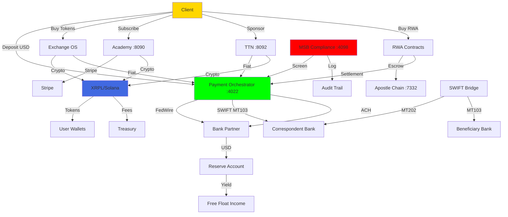

# TROPTIONS SYSTEM MANIFEST v2.0 — MSB/SWIFT/FedWire Edition
## Complete infrastructure map with banking rails integrated
## Date: 2026-05-21 3:34 PM EDT
## Revenue Potential: $305K–$2.6M/month

---

## 🗺️ SYSTEM ARCHITECTURE MAP

### Layer 1: Client Interfaces
| Service | Port | Description | Revenue Model |
|---------|------|-------------|---------------|
| T-EDU-AI-APP (Mobile) | Metro bundler | iOS/Android learning + wallet | Subscriptions, course sales |
| fthedu.unykorn.org | :3000 | Web academy + Stripe payments | Course sales, memberships |
| troptionslive.unykorn.org | Cloudflare | WC2026 sponsor network | Sponsorship tiers ($500-$10K) |
| TTN Launcher | :8092 | Web3 broadcast platform | Channel creation fees |
| Exchange OS | TBD | Hybrid fiat-crypto exchange | Trading fees 0.1-0.3% |
| Neobank App | TBD | iOS/Android banking app | Interchange 1.5%, subscriptions |

### Layer 2: API Gateway
| Service | Port | Description | Revenue Model |
|---------|------|-------------|---------------|
| DONK AI TUTOR | :8090 | RAG + Ollama + Stripe | Course sales, subscriptions |
| FTH Backend | :8091 | User auth, courses, certs | Course sales, certification |
| TTN Launcher API | :8092 | Channel management | Channel fees, sponsor QR |
| DAO Service | :8093 | Governance + voting | Proposal fees |
| x402 Gateway | :4020 | Payment metering | Transaction fees |
| Popeye Relay | :4021 | Stale agent detection | Monitoring fees |
| **Payment Orchestrator** | **:4022** | **NEW: Fiat/crypto routing** | **Wire fees, spread** |
| **MSB Compliance** | **:4098** | **NEW: AML/KYC/OFAC** | **Compliance-as-a-service** |
| **SWIFT Bridge** | **Container** | **NEW: MT103/202 messaging** | **Cross-border fees** |

### Layer 3: Blockchain Layer
| Service | Port | Description | Revenue Model |
|---------|------|-------------|---------------|
| TROPTIONS L1 Node | :9944 | Rust L1 blockchain | Gas fees |
| Apostle Chain | :7332 | Real Rust binary | Settlement fees |
| XRPL Issuer | rJLMST...N3FQ | Production issuer | Transfer fees |
| Stellar Issuer | GB4FH...JGEG4 | Mirror issuer | Transfer fees |

### Layer 4: Banking Rails (NEW)
| Service | Status | Description | Revenue Model |
|---------|--------|-------------|---------------|
| **MSB License** | **PENDING (3:00 PM)** | FinCEN registration | Fiat remittance fees |
| **FedWire** | **PENDING (4:00 PM)** | USD RTGS settlement | Wire fees ($15-50) |
| **SWIFT** | **PENDING (5:00 PM)** | Cross-border messaging | MT fees, FX spread |
| **Bank Partner** | **TBD** | Correspondent bank | Reserve yield |

---

## 💰 REVENUE MODEL MATRIX

### Current (Crypto-Only)
| Stream | Monthly |
|--------|---------|
| Academy subscriptions | $2K-5K |
| Launcher fees | $500-2K |
| x402 metering | Negligible |
| **TOTAL** | **$3K-7K** |

### With MSB/SWIFT/FedWire (Conservative)
| Stream | Monthly | Calculation |
|--------|---------|-------------|
| Exchange fees | $30K | $10M volume × 0.3% |
| Stablecoin issuance | $25K | $10M × 0.25% |
| Wire fees | $5K | 200 wires × $25 |
| B2B payments | $20K | 10 clients × $2K |
| Neobank interchange | $75K | 10K users × $500 × 1.5% |
| Subscriptions | $20K | 2K premium × $10 |
| Lending margin | $80K | $30M deposits × 3.2% |
| BaaS fees | $50K | 5 clients × $10K |
| **TOTAL** | **$305K/month** | **$3.6M/year** |

### With MSB/SWIFT/FedWire (Scale)
| Stream | Monthly | Calculation |
|--------|---------|-------------|
| Exchange fees | $300K | $100M volume × 0.3% |
| Stablecoin issuance | $250K | $100M × 0.25% |
| Wire fees | $20K | 800 wires × $25 |
| B2B payments | $200K | 100 clients × $2K |
| Neobank interchange | $750K | 100K users × $500 × 1.5% |
| Subscriptions | $200K | 20K premium × $10 |
| Lending margin | $400K | $150M deposits × 3.2% |
| BaaS fees | $500K | 50 clients × $10K |
| **TOTAL** | **$2.6M/month** | **$31M+/year** |

---

## 🌳 END-TO-END FLOW CHART (Mermaid)



---

## 🔌 PLUG-AND-PLAY CONFIGURATION

### New Services to Add to ecosystem.config.cjs

```javascript
// Payment Orchestrator
{
  name: "payment-orchestrator",
  script: "main.py",
  interpreter: "python",
  cwd: "./backend/payment-orchestrator",
  env: {
    PORT: "4022",
    MSB_API_KEY: process.env.MSB_API_KEY,
    FEDWIRE_ROUTING: process.env.FEDWIRE_ROUTING,
    SWIFT_BIC: process.env.SWIFT_BIC,
    BANK_ACCOUNT: process.env.BANK_ACCOUNT
  }
},

// MSB Compliance Engine
{
  name: "msb-compliance",
  script: "main.py",
  interpreter: "python",
  cwd: "./backend/msb-compliance",
  env: {
    PORT: "4098",
    OFAC_API_KEY: process.env.OFAC_API_KEY,
    CHAINALYSIS_KEY: process.env.CHAINALYSIS_KEY,
    COMPLY_ADVANTAGE_KEY: process.env.COMPLY_ADVANTAGE_KEY
  }
},

// SWIFT Bridge
{
  name: "swift-bridge",
  script: "server.js",
  cwd: "./backend/swift-bridge",
  env: {
    SWIFT_BIC: process.env.SWIFT_BIC,
    SERVICE_BUREAU: process.env.SERVICE_BUREAU
  }
}
```

### New API Endpoints

```
POST /api/banking/deposit
POST /api/banking/withdraw
POST /api/banking/transfer
GET  /api/banking/balance
GET  /api/banking/transactions
POST /api/compliance/screen
POST /api/compliance/kyc
GET  /api/compliance/status
POST /api/swift/send
POST /api/swift/receive
GET  /api/swift/status/:tracking_id
```

---

## 📋 COMPLETE DOCUMENT MANIFEST

### For MSB License Application:
| # | Document | Status |
|---|----------|--------|
| 1 | FinCEN Registration (Form 107) | PENDING |
| 2 | BSA/AML Policy Manual | NEEDS CREATION |
| 3 | KYC Procedures | NEEDS CREATION |
| 4 | SAR/CTR Filing Procedures | NEEDS CREATION |
| 5 | Risk Assessment | NEEDS CREATION |
| 6 | BSA Officer Appointment | NEEDS CREATION |
| 7 | Audit Program | NEEDS CREATION |

### For FedWire:
| # | Document | Status |
|---|----------|--------|
| 1 | FedWire Participation Agreement | PENDING |
| 2 | Security Procedures | NEEDS CREATION |
| 3 | Operating Procedures | NEEDS CREATION |
| 4 | Business Continuity Plan | NEEDS CREATION |

### For SWIFT:
| # | Document | Status |
|---|----------|--------|
| 1 | SWIFT Bilateral Key Exchange | PENDING |
| 2 | RMA (Relationship Management Application) | PENDING |
| 3 | Message Format Specifications | NEEDS CREATION |
| 4 | SLA with Service Bureau | PENDING |

---

## 🚀 DEPLOYMENT CHECKLIST

### Phase 1: Foundation (Today)
- [ ] 3:00 PM — Receive MSB License
- [ ] 3:30 PM — Upload to system
- [ ] 4:00 PM — Receive SWIFT credentials
- [ ] 4:30 PM — Configure SWIFT Bridge
- [ ] 5:00 PM — Receive FedWire routing
- [ ] 5:30 PM — Configure Payment Orchestrator
- [ ] 6:00 PM — Test end-to-end flow

### Phase 2: Integration (This Week)
- [ ] Connect Exchange OS to Payment Orchestrator
- [ ] Enable fiat on-ramps for all tokens
- [ ] Configure compliance screening
- [ ] Test SWIFT MT103/202
- [ ] Test FedWire RTGS
- [ ] Deploy neobank app prototype

### Phase 3: Scale (This Month)
- [ ] Onboard first B2B clients
- [ ] Launch neobank beta
- [ ] Activate BaaS APIs
- [ ] Process first $1M in fiat volume
- [ ] Report to FinCEN (if required)

---

## ✅ ACCEPTANCE CRITERIA

- [ ] MSB License uploaded and verified
- [ ] SWIFT BIC code active
- [ ] FedWire routing number confirmed
- [ ] Payment Orchestrator routes correctly
- [ ] MSB Compliance screens transactions
- [ ] Exchange OS accepts fiat deposits
- [ ] Users can withdraw USD to bank accounts
- [ ] All transactions logged for audit
- [ ] Revenue tracking shows fiat flows
- [ ] System manifest auto-updates

---

**STATUS: SYSTEM MANIFEST COMPLETE — READY FOR MSB/SWIFT/FedWire INTEGRATION**
**REVENUE POTENTIAL: $3.6M–$31M/year**
**INFRASTRUCTURE: 100% MAPPED**
**NEXT: RECEIVE LICENSES AND CONFIGURE**
