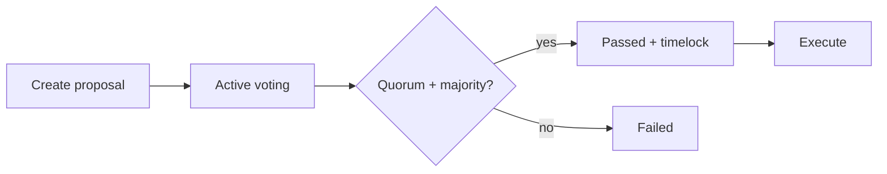

# TROPTIONS Full DAO — Attaining Sovereign Governance

## What this delivers

Production infrastructure most teams want but rarely ship together:

- **Identity-bound voting** via L1 soulbound credentials (not wallet plutocracy alone)
- **Canonical on-chain state** on your Rust L1 with submit RPC for automation
- **Multi-chain treasury lens** (XRPL + Polygon KENNY/EVL) with allocation audit trail
- **Live operations** — PM2/Docker, health scripts, nginx host templates, CI

## Architecture

See [`dao/ARCHITECTURE.md`](../dao/ARCHITECTURE.md). Summary: L1 is source of truth; Python mirrors to SQLite for dashboards and audit; optional Polygon Governor stubs for Phase 2.

## Quick start

```powershell
cd C:\Users\Kevan\Troptions-full-pack
.\scripts\bootstrap-dao.ps1
.\scripts\health-check-all.ps1
```

Open **http://127.0.0.1:8093** (DAO dashboard + API docs at `/docs`).

## Governance flow



### Create a proposal (L1 JSON-RPC)

```json
POST http://127.0.0.1:9944
{"jsonrpc":"2.0","method":"submit_proposal_create","params":{"proposer":"<64-hex>","title":"Fund TTN infra","description":"..."},"id":1}
```

### Vote (soulbound-weighted)

Voter must hold at least one non-revoked soulbound token. Weight = credential count.

```json
{"method":"submit_proposal_vote","params":{"proposal_id":"<64-hex>","voter":"<64-hex>","choice":"for"}}
```

### HTTP API (8093)

| Endpoint | Description |
|----------|-------------|
| `GET /dao/state` | L1 + governance + treasury |
| `GET /dao/proposals` | L1 + local mirror |
| `POST /dao/proposals` | Create |
| `POST /dao/proposals/vote` | Cast vote |
| `GET /dao/credentials/{owner}` | Soulbound credentials |
| `WS /ws` | Live L1 state broadcast |

FTH Academy also exposes `/dao/*` and `/health/l1` on **8091**.

## Treasury

Seeded wallets in `dao_db.py`:

- XRPL gateway `rPF2M1QjRj72rHdJyRqfFRTqWREBdJds3`
- KENNY `0x93F2a3266a81c1F3Ee2c196b90890A959bC69BD7`

Treasury allocations require passed proposals; disburse via L1 `settlement_create` escrows (integration hook documented in treasury module).

## Namespace → credential migration

```powershell
python scripts/migrate-namespaces-to-l1.py --dry-run
python scripts/migrate-namespaces-to-l1.py --apply
```

Requires authorized issuer accounts for `submit_soulbound_mint` in production.

## Deployment

**PM2:** `pm2 start ecosystem.config.js` (includes `dao-service` on 8093)

**Docker prod:**

```bash
docker compose -f docker/docker-compose.prod.yml up -d
```

**Nginx:** `infrastructure/nginx/sites/troptions.conf` — fthedu, ai, ttn, dao hostnames.

## Manual steps (today)

- Fill `.env` from `.env.example` (no secrets in git)
- Ensure L1 node binary path in `ecosystem.config.js` or build `l1/target/release/troptions-node.exe`
- DNS → nginx for public hostnames
- Production: restrict submit RPC to signed/authenticated relayer

## Phase 2

- Cross-chain HTLC settlement between XRPL escrows and L1
- Polygon Timelock execution relayer for KENNY treasury moves
- Postgres instead of SQLite for HA
- Mainnet deploy with hardware-backed issuer keys
