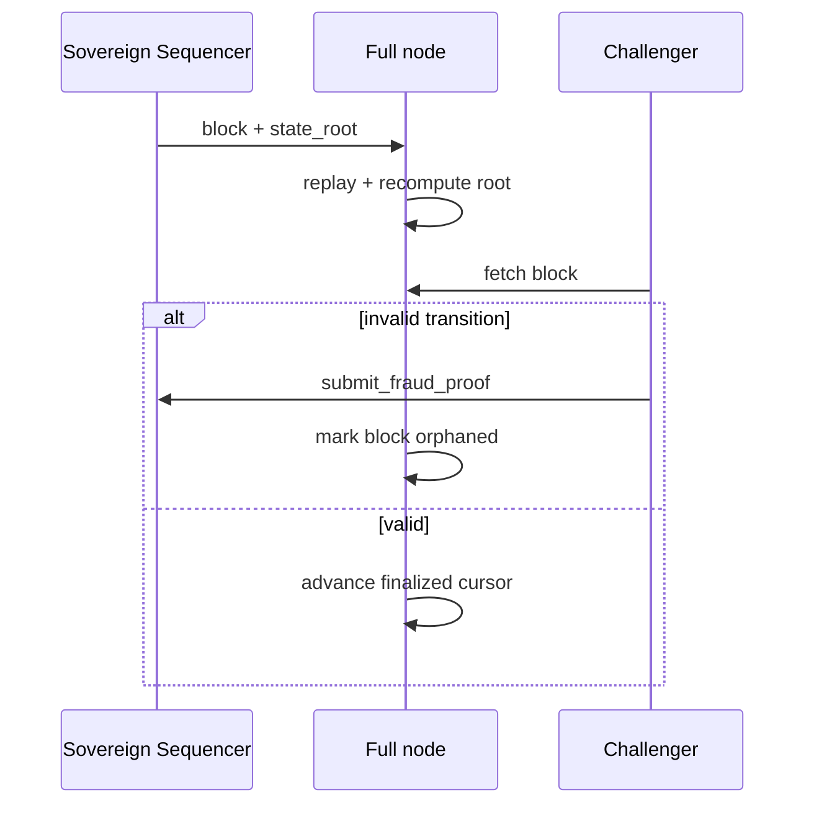

# Fraud proofs — multi-node design (Q4 2026)

**Status:** Design only — **not implemented** on `main`. The live stack uses a **Sovereign Sequencer** (single ordering node). This document describes the planned path to verifiable multi-node operation without claiming BFT today.

## Goals

1. Allow a **challenger** to dispute an invalid state transition published by the sequencer.
2. Keep **deterministic** L1 state transitions (same inputs → same post-state) for replay and proof verification.
3. Preserve **operator-controlled** rollout: testnets first, no false “decentralized consensus” marketing before code ships.

## Threat model (target)

| Actor | Capability |
|-------|------------|
| Sequencer | Orders txs, proposes blocks, may censor or stall |
| Challenger | Downloads blocks/state roots, submits fraud proofs |
| Full node | Replays blocks, verifies Ed25519 signatures and state rules |

**Out of scope for v1 fraud proofs:** permissionless validator set, automatic slashing on L1, cross-chain light clients.

## Data structures (draft)

- **Block header:** `height`, `parent_hash`, `state_root`, `tx_root`, `sequencer_sig`
- **Fraud proof bundle:** `(pre_state_root, tx_or_batch, post_state_root_claimed, post_state_root_computed, witness)`
- **Dispute window:** N blocks after publication before finality label in indexers

## Verification flow

## RPC additions (planned)

| Method | Purpose |
|--------|---------|
| `block_get` | Fetch header + tx list by height |
| `fraud_proof_submit` | Challenger posts proof bundle |
| `fraud_proof_get` | Query dispute status |

## Relationship to BFT roadmap

Fraud proofs are a **stepping stone**: they increase verifiability before a full BFT quorum (see [ROADMAP](../ROADMAP.html)). They do **not** replace signed DAO paths or API-key-protected operator APIs on the current sequencer.

## Honest labeling

Until this ships:

- Docs and README say **Sovereign Sequencer**, not BFT.
- Truth label `FRAUD_PROOFS_LIVE` stays **PENDING**.
- GitHub Pages maturity for fraud proofs is design-only.

## References (repo)

- State: `l1/crates/state/`
- Governance signatures: `l1/crates/governance/`
- Persistence: `l1/crates/state/src/persistence.rs`
