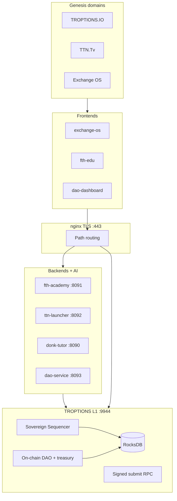

<section class="hero">
  <picture>
    <source srcset="{{ '/assets/images/troptions-logo-primary.webp' | relative_url }}" type="image/webp">
    
  </picture>
  
  <h1>TROPTIONS Sovereign Stack</h1>
  <p class="tagline">Operating company and open infrastructure for education, broadcast, governance, and exchange on a sovereign L1.</p>
  <p class="maturity-badge"><strong>Maturity 9.0 / 10</strong> on <code>main</code> — honest scope; not claiming BFT or live fraud proofs.</p>
</section>

<section class="troptions-theme-audio" aria-labelledby="troptions-theme-heading">
  <h2 id="troptions-theme-heading">TROPTIONS Theme</h2>
  <p class="theme-caption">Brand anthem — <em>Mainframe Explode</em> (proprietary FTH Trading; play manually, no autoplay).</p>
  <div class="theme-player" role="group" aria-label="Theme audio controls">
    <div class="theme-track-select">
      <button type="button" class="theme-track-btn is-active" data-src="{{ '/assets/audio/troptions-theme-primary.mp3' | relative_url }}" aria-pressed="true">Primary</button>
      <button type="button" class="theme-track-btn" data-src="{{ '/assets/audio/troptions-theme-alt.mp3' | relative_url }}" aria-pressed="false">Alt</button>
    </div>
    <button type="button" class="theme-play-btn" aria-pressed="false">Play</button>
    <audio preload="metadata" src="{{ '/assets/audio/troptions-theme-primary.mp3' | relative_url }}">
      <p>Your browser does not support audio. <a href="{{ '/assets/audio/troptions-theme-primary.mp3' | relative_url }}">Download primary theme</a>.</p>
    </audio>
  </div>
</section>

## What is TROPTIONS?

**TROPTIONS** is the operating brand and engineering home for a **sovereign stack**: a Layer-1 ledger, service backends, web frontends, and proof artifacts shipped together in this monorepo. The company side covers domains, education (FTH Academy), broadcast (TTN), and exchange surfaces; the infrastructure side is what developers clone, run, and extend.

This repository (**Troptions-full-pack**) is the **full pack** — not a slide deck. It contains the **Rust L1 node** (`l1/`), **Python backends** (academy, TTN launcher, DAO service), **frontends** (exchange OS, edu, DAO dashboard), **contracts and DAO tooling**, Docker/nginx production templates, and **truth-label / verify scripts** so claims stay checkable.

**Who it is for:** **Developers** wiring integrations and running local or staged stacks; **investors and counterparties** who need a single honest map of what ships on `main` versus roadmap; and **operators** preparing TLS, API keys, and L1-backed governance before public DNS cutover.

**What it is not (on `main`):** Byzantine fault-tolerant consensus, permissionless validator sets, or a merged public x402 payment rail — those are documented separately or on feature branches without overclaiming production status.

## What each layer means

| Layer | What it does | Port |
|-------|----------------|------|
| **L1 node** | Sovereign sequencer, RocksDB state, on-chain DAO/treasury, signed submit RPC | **9944** (RPC), **9945** (metrics) |
| **nginx edge** | TLS termination and path routing to L1 and backends | **443** (template) |
| **fth-academy** | Courses, Stripe hooks, DAO helpers, L1 client | **8091** |
| **ttn-launcher** | TTN channel / namespace registry | **8092** |
| **donk-tutor** | AI tutor backend | **8090** |
| **dao-service** | DAO API, WebSocket hub, settlement gateway | **8093** |
| **Frontends** | exchange-os, fth-edu, dao-dashboard — static/UI over APIs | (via nginx / static host) |
| **Proof / labels** | Scripts and docs that tag LIVE vs LOCAL vs ROADMAP claims | — |

Deeper pages: [L1]({{ '/infrastructure/l1.html' | relative_url }}), [backends]({{ '/infrastructure/backends.html' | relative_url }}), [frontends]({{ '/infrastructure/frontends.html' | relative_url }}).

## Maturity 9.0

Engineering targets met on **`main`** (single-node **Sovereign Sequencer**, **11 Rust workspace crates**, RocksDB-backed state, PM2/Docker prod compose). Public DNS/certbot and multi-node fraud proofs remain **Q4 2026**.

- [x] **TLS_ENABLED** — `docker/nginx/` self-signed + HTTPS paths `/l1/`, `/ai/`, `/fth/`, `/ttn/`, `/dao/`
- [x] **API_KEY_AUTH** — `backend/shared/auth.py`, `API_KEYS` / `SETTLEMENT_API_KEYS`
- [x] **DAO_DIRECT_L1** — `dao_getProposals`, `dao_getVotes`, `treasury_getBalance`; SQLite audit-only
- [x] **SIGNED_DAO_RPC** — `dao_submit_proposal` / `dao_cast_vote` / `dao_execute` + `scripts/l1-gov-sign.py`
- [x] **SOVEREIGN_SEQUENCER** — documented; [fraud proofs design]({{ '/design/fraud-proofs.html' | relative_url }}) only
- [ ] **TLS_PUBLIC_DNS** — certbot on production hostnames (ops)
- [ ] **FRAUD_PROOFS_LIVE** — Q4 2026 design → implementation

## Architecture



## Get started

- [Deploy quickstart]({{ '/deploy/quickstart.html' | relative_url }})
- [Truth labels]({{ '/proof/truth-labels.html' | relative_url }}) — what is LIVE vs LOCAL vs ROADMAP
- [Production checklist]({{ '/deploy/production-checklist.html' | relative_url }})
- [GitHub repository](https://github.com/fthtrading/Troptions-full-pack)

Verify locally:

```powershell
cd l1; cargo test --workspace
cd ..; python -m pytest tests/backend tests/dao -q
.\scripts\truth_labels.ps1
.\scripts\verify-9-production.ps1
```

**Note:** x402 / Apostle integration lives on `feature/x402-full-integration` and is **not** merged to `main`; this site describes `main` unless a page says otherwise.
