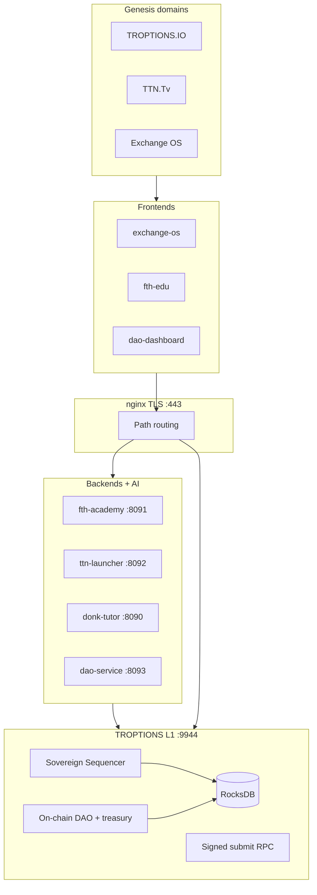

# TROPTIONS Sovereign Stack

**Maturity: 9.0 / 10** — TLS termination template, API-key write auth, DAO dashboard reads L1 directly, signed DAO RPC paths, Sovereign Sequencer labeling (not BFT). Public DNS/certbot cutover and multi-node fraud proofs remain **Q4 2026**.

Honest scope: **single-node Sovereign Sequencer**, **11 Rust workspace crates** under `l1/`, RocksDB-backed state, PM2/docker prod compose. **No BFT** and **no public x402** on `main`.

## 9.0 checklist (engineering complete on `main`)

- [x] **TLS_ENABLED** — `docker/nginx/` self-signed + HTTPS paths `/l1/`, `/ai/`, `/fth/`, `/ttn/`, `/dao/`
- [x] **API_KEY_AUTH** — `backend/shared/auth.py`, `API_KEYS` / `SETTLEMENT_API_KEYS`, dao + settlement + sensitive FTH/TTN writes
- [x] **DAO_DIRECT_L1** — `dao_getProposals`, `dao_getVotes`, `treasury_getBalance`; SQLite audit-only
- [x] **SIGNED_DAO_RPC** — `dao_submit_proposal` / `dao_cast_vote` / `dao_execute` + `scripts/l1-gov-sign.py`
- [x] **SOVEREIGN_SEQUENCER** — docs/README; fraud proofs design only ([fraud proofs]({{ '/design/fraud-proofs.html' | relative_url }}))
- [ ] **TLS_PUBLIC_DNS** — certbot on production hostnames (ops)
- [ ] **FRAUD_PROOFS_LIVE** — Q4 2026 design → implementation

## Architecture



## Proof and deploy

- [Truth labels]({{ '/proof/truth-labels.html' | relative_url }})
- [Quickstart]({{ '/deploy/quickstart.html' | relative_url }})
- [Production checklist]({{ '/deploy/production-checklist.html' | relative_url }})
- Verify: `scripts/verify-9-production.ps1`

## Optional / separate branches

- **x402 / Apostle** — `feature/x402-full-integration` **not merged**; LOCAL_ONLY on main

## Verify locally

```powershell
cd l1; cargo test --workspace
cd ..; python -m pytest tests/backend tests/dao -q
.\scripts\truth_labels.ps1
.\scripts\verify-9-production.ps1
```
