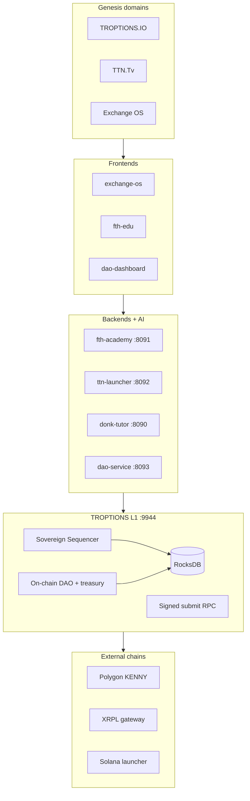

# TROPTIONS Sovereign Stack

**Maturity: 8.2 / 10** (post `upgrade/10-production` merge on `main`) — production-grade L1 persistence and signed RPC; ops cutover (TLS, public x402) still pending.

Honest scope: this monorepo ships a **single-node Sovereign Sequencer** (not BFT), **11 Rust workspace crates** under `l1/` (not 27), RocksDB-backed state, and PM2/docker paths for backends and DAO. Byzantine quorum is **Q4 2026** on the [roadmap](roadmap.html).

## Architecture



Source: [`assets/diagrams/stack.mmd`]({{ '/assets/diagrams/stack.mmd' | relative_url }})

## What shipped on main

| Area | Status | Source |
|------|--------|--------|
| RocksDB persistence | Live in code | [`l1/crates/state/src/persistence.rs`](https://github.com/fthtrading/Troptions-full-pack/blob/main/l1/crates/state/src/persistence.rs) |
| Signed `submit_transaction` | Tests pass | [`l1/tests/integration/signed_submit.rs`](https://github.com/fthtrading/Troptions-full-pack/blob/main/l1/tests/integration/signed_submit.rs) |
| Treasury multisig | Threshold 1000 | [`l1/crates/runtime/src/multisig.rs`](https://github.com/fthtrading/Troptions-full-pack/blob/main/l1/crates/runtime/src/multisig.rs) |
| DAO on L1 | Governance crate + dashboard RPC | [`l1/crates/governance/`](https://github.com/fthtrading/Troptions-full-pack/tree/main/l1/crates/governance) |
| Metrics | Prometheus `:9945` | [`l1/crates/rpc/src/metrics.rs`](https://github.com/fthtrading/Troptions-full-pack/blob/main/l1/crates/rpc/src/metrics.rs) |
| Prod compose | Template + deploy scripts | [`docker/docker-compose.prod.yml`](https://github.com/fthtrading/Troptions-full-pack/blob/main/docker/docker-compose.prod.yml) |

~~In-memory only~~ — **removed** after RocksDB merge; set `L1_DATA_DIR` for durable nodes.

## Proof and deploy

- [Truth labels]({{ '/proof/truth-labels.html' | relative_url }}) — CONFIRMED vs PENDING with reproduction commands
- [On-chain proofs]({{ '/proof/on-chain-proofs.html' | relative_url }}) — KENNY, XRPL gateway
- [Quickstart]({{ '/deploy/quickstart.html' | relative_url }}) — local full stack
- [Production checklist]({{ '/deploy/production-checklist.html' | relative_url }}) — internal 7.5 → 10 tracker

## Optional / separate branches

- **x402 / Apostle** — `feature/x402-full-integration`; **LOCAL_ONLY** on main; see [infrastructure/x402]({{ '/infrastructure/x402.html' | relative_url }})
- Exchange OS **$175M desk** references — operator attestation / desk tooling only; not verified on-chain by this repo

## Verify locally

```powershell
cd l1; cargo test --workspace
cd ..; python -m pytest tests/backend tests/dao -q
.\scripts\truth_labels.ps1
```

Full internal docs: [`ARCHITECTURE.md`](ARCHITECTURE.html), [`L1_SPEC.md`](L1_SPEC.html), [`UPGRADE_REPORT.md` on repo root](https://github.com/fthtrading/Troptions-full-pack/blob/main/UPGRADE_REPORT.md).
