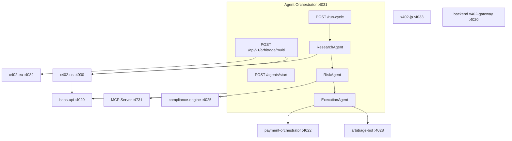

# Agentic RAG + AMM Orchestration

**Status:** PIPELINE (stubs respond; revenue figures are **PROJECTION**)  
**Date:** 2026-05-21

## Architecture



## Agent Orchestration Layer (`fiat-rails/agent-orchestrator/`)

| File | Role |
|------|------|
| `server.js` | Express — `/agents/start`, `/agents/stop`, `/agents/status`, `/run-cycle`, `/api/v1/arbitrage/multi` |
| `agent-runner.js` | Research → Risk → Execute loop; `DRY_RUN` default |
| `mcp-client.js` | MCP at `:4731` (mock when down) |
| `x402-client.js` | Regional gateways; stats at `:4030/x402/stats` |
| `compliance-client.js` | `:4025` |
| `baas-client.js` | `:4029` |
| `orchestrator-client.js` | payment-orchestrator `:4022` |
| `arbitrage-client.js` | `:4028` + multi-mesh stub |
| `config.js` | Agent profiles |

## Port map (local PM2)

| Service | Port | Path | Label |
|---------|------|------|-------|
| backend `x402-gateway` (Apostle mesh) | **4020** | `backend/x402-gateway/` | PROVEN (health) |
| payment-orchestrator | **4022** | `fiat-rails/orchestrator/` | PIPELINE |
| compliance-engine | **4025** | `fiat-rails/compliance-engine/` | PIPELINE |
| arbitrage-bot | **4028** | `fiat-rails/arbitrage-bot/` | PIPELINE |
| **baas-api** | **4029** | `fiat-rails/baas-api/` | PIPELINE |
| x402-gateway-v2 (US) | **4030** | `fiat-rails/x402-gateway/` | PIPELINE |
| **agent-orchestrator** | **4031** | `fiat-rails/agent-orchestrator/` | PIPELINE |
| x402-gateway-eu | **4032** | `fiat-rails/x402-gateway-eu/` | PIPELINE |
| x402-gateway-jp | **4033** | `fiat-rails/x402-gateway-jp/` | PIPELINE |
| MCP XRPL (reserved) | **4032** | external vendor | PIPELINE |
| baas-dashboard (UI) | **4040** | `fiat-rails/baas-dashboard/` | PIPELINE |
| MCP (external) | **4731** | vendor install | PIPELINE |

See [MULTI_X402_MESH](MULTI_X402_MESH.html) for NY / Frankfurt / Tokyo ports (**4030** / **4032** / **4033**).

## BaaS agent API (`:4029`)

| Method | Path |
|--------|------|
| POST | `/api/v1/agents` — register |
| POST | `/api/v1/agents/:id/trades` — report trade |
| GET | `/api/v1/agents/:id/revenue` — **PROJECTION** |

## x402 stats

- **Canonical:** `GET http://127.0.0.1:4030/x402/stats` (alias `GET /stats`)
- **EU / JP:** `:4032` / `:4033` — same path
- **Apostle mesh:** `GET http://127.0.0.1:4020/health` (Python sidecar)

## Agent revenue honesty

| Claim | Truth label |
|-------|-------------|
| Health + cycle JSON | **PROVEN** (stub logic) |
| Arbitrage profit today | **PIPELINE** |
| x402 fee totals | **PROJECTION** |
| Agent revenue / $791K marketing | **PROJECTION — NOT FACT** |
| MCP ledger reads | **PIPELINE** (needs MCP on :4731) |

## Activation

```powershell
.\scripts\deploy-agentic-floor.ps1
.\scripts\activate-troptions-revenue.ps1 -DryRun
.\scripts\setup-second-x402.ps1
```

## API quick reference

```bash
# Lifecycle
curl -X POST http://127.0.0.1:4031/agents/start -H "Content-Type: application/json" -d '{"agent_id":"agent-demo"}'
curl http://127.0.0.1:4031/agents/status?agent_id=agent-demo
curl -X POST http://127.0.0.1:4031/agents/stop -H "Content-Type: application/json" -d '{"agent_id":"agent-demo"}'

# Cycle (DRY_RUN default)
curl -X POST http://127.0.0.1:4031/run-cycle -H "Content-Type: application/json" -d '{"agent_id":"agent-demo","wallet":"rDemo","capital_troptions":100000,"dry_run":true}'

# BaaS
curl -X POST http://127.0.0.1:4029/api/v1/agents -H "Content-Type: application/json" -d '{"agent_id":"agent-demo","wallet":"rDemo","capital_troptions":100000}'
curl http://127.0.0.1:4029/api/v1/agents/agent-demo/revenue

# Multi-x402 arbitrage
curl -X POST http://127.0.0.1:4031/api/v1/arbitrage/multi -H "Content-Type: application/json" -d '{"buy_location":"us","sell_location":"eu","dry_run":true}'

# x402 stats
curl http://127.0.0.1:4030/x402/stats
```

See also: [TROPTIONS_REVENUE_ENGINE.md](TROPTIONS_REVENUE_ENGINE.md), [MULTI_X402_MESH.md](MULTI_X402_MESH.md), [SYSTEM_MANIFEST.md](SYSTEM_MANIFEST.md).
