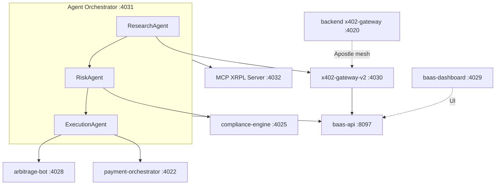

# Agentic RAG + AMM Orchestration

**Status:** PIPELINE (stubs respond; revenue figures are PROJECTION)  
**Date:** 2026-05-21

## Architecture



## Port map (local PM2)

| Service | Port | Path | Label |
|---------|------|------|-------|
| backend `x402-gateway` (Apostle mesh) | **4020** | `backend/x402-gateway/` | PROVEN (health) |
| popeye-relay | 4021 | `backend/popeye-relay/` | PIPELINE |
| payment-orchestrator | **4022** | `fiat-rails/orchestrator/` | PIPELINE |
| fedwire-adapter | 4023 | `fiat-rails/fedwire-adapter/` | PIPELINE |
| swift-bridge | 4024 | `fiat-rails/swift-bridge/` | PIPELINE |
| compliance-engine | **4025** | `fiat-rails/compliance-engine/` | PIPELINE |
| neobank-api | 4026 | `fiat-rails/neobank-api/` | PIPELINE |
| iou-reserve-monitor | 4027 | `fiat-rails/iou-reserve-monitor/` | PIPELINE |
| arbitrage-bot | **4028** | `fiat-rails/arbitrage-bot/` | PIPELINE |
| baas-dashboard (UI) | **4029** | `fiat-rails/baas-dashboard/` | PIPELINE |
| x402-gateway-v2 (paid proxies + stats) | **4030** | `fiat-rails/x402-gateway/` | PIPELINE |
| **agent-orchestrator** | **4031** | `fiat-rails/agent-orchestrator/` | PIPELINE |
| MCP XRPL (external vendor) | **4032** | install per `scripts/setup-mcp-xrpl.ps1` | PIPELINE |
| baas-api (liquidity API) | **8097** | `fiat-rails/baas-api/` | PIPELINE |

**Note:** User-facing BaaS “:4029” is the dashboard; programmatic agent registration uses **baas-api :8097** (`POST /api/v1/agents/register`). The orchestrator proxies registration to 8097.

## x402 stats

- **Canonical (fiat-rails):** `GET http://127.0.0.1:4030/x402/stats`
- **Legacy mesh sidecar:** `GET http://127.0.0.1:4020/health` (Python gateway)

## Agent revenue honesty

| Claim | Truth label |
|-------|-------------|
| Health endpoints return JSON | **PROVEN** |
| Agent cycle runs Research → Risk → Execution | **PROVEN** (stub logic) |
| Arbitrage profit today | **PIPELINE** until MSB omnibus + live pools |
| x402 metered revenue totals | **PROJECTION** (counters at zero) |
| MCP XRPL ledger reads | **PIPELINE** (requires vendor MCP on :4032) |
| FTH Academy Stripe | **PROVEN** (separate product) |

## Tool wrappers (`agent-orchestrator/lib/tools.js`)

| Tool | Target |
|------|--------|
| `execute_arbitrage` | `POST :4028/execute` or `/start`; fallback `POST :4022/api/v1/arbitrage` |
| `compliance_screen` | `POST :4025/screen` |
| `x402_pay_and_fetch` | `GET :4030/x402/...` with mock `X-402-Payment` |
| `registerAgent` | `POST :8097/api/v1/agents/register` |

## MCP XRPL setup

```powershell
.\scripts\setup-mcp-xrpl.ps1
```

Install the vendor MCP XRPL server separately (placeholder repo in script). Set `MCP_XRPL_URL=http://127.0.0.1:4032` in `fiat-rails/agent-orchestrator/.env`.

## Activation

```powershell
.\scripts\activate-troptions-revenue.ps1 -DryRun
```

## API quick reference

```bash
# Agent cycle (DRY_RUN default true)
curl -X POST http://127.0.0.1:4031/run-cycle -H "Content-Type: application/json" -d "{\"agent_id\":\"agent-demo\",\"wallet\":\"rDemo\",\"capital_troptions\":100000,\"dry_run\":true}"

# Register agent (orchestrator proxy → baas-api)
curl -X POST http://127.0.0.1:4031/agents/register -H "Content-Type: application/json" -d "{\"agent_id\":\"agent-demo\",\"wallet\":\"rDemo\",\"capital_troptions\":100000}"

# Arbitrage
curl -X POST http://127.0.0.1:4028/start
curl -X POST http://127.0.0.1:4028/execute -H "Content-Type: application/json" -d "{\"dry_run\":true}"

# x402 stats (use 4030, not 4020)
curl http://127.0.0.1:4030/x402/stats
```

See also: [TROPTIONS_REVENUE_ENGINE.md](TROPTIONS_REVENUE_ENGINE.md), [ARBITRAGE_AND_BAAS.md](ARBITRAGE_AND_BAAS.md).
