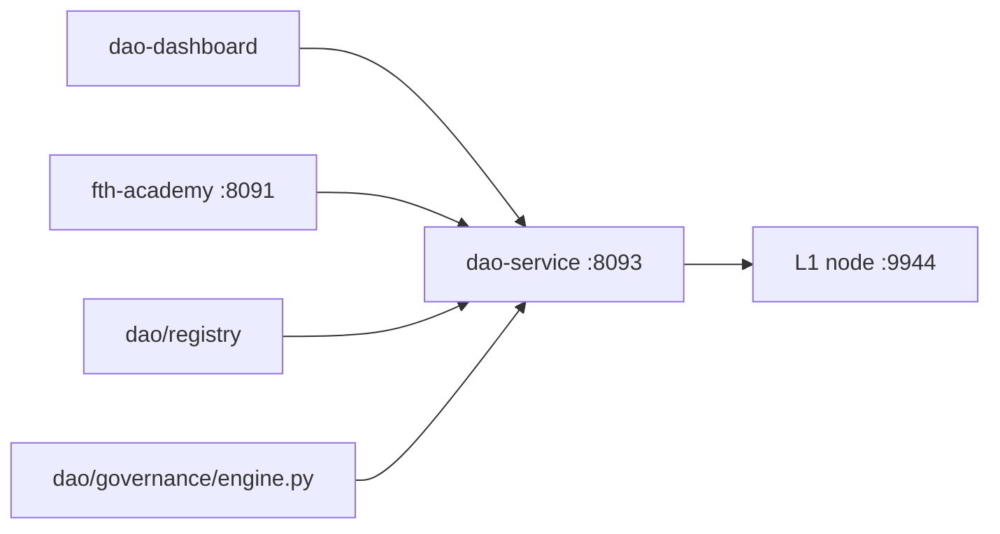

# Sovereign DAO — technical architecture

**Last updated:** 2026-05-21  
**Public overview:** [Sovereign DAO on GitHub Pages](../dao/index.html)  
**Operator runbook:** [DAO.md](DAO.html) · repo `docs/technical/DAO.md`

---

## Design decision

| Layer | Location | Role |
|-------|----------|------|
| **Canonical state** | `l1/crates/governance` + `state` | Proposals, soulbound-weighted votes, timelock, namespace registry |
| **RPC** | `l1/crates/rpc` + `troptions-node` `:9944` | Query + signed `dao_*` submit |
| **Orchestration** | `dao/governance`, `dao/treasury`, `dao/registry` | Business rules, multi-chain treasury lens, genesis brand bridge |
| **HTTP API** | `backend/dao-service` `:8093`, `backend/fth-academy` `/dao/*` | Dashboard, WebSocket, enrollment hooks |
| **Persistence mirror** | `backend/shared/dao_db.py` | SQLite audit log (Postgres-ready) — **not** canonical |
| **UI** | `frontends/dao-dashboard` | Reads L1 via `dao-service`; `app.js` can call L1 directly |

**Not canonical:** Polygon GovernorBravo / Timelock stubs in `dao/contracts/` — optional Phase 2 for KENNY/EVL escrow votes. **L1 soulbound credentials** anchor identity and quorum.

---

## Why L1-native (not EVM-only)

1. **Non-capturable policy** — upgradeable proxy governors are a known seizure surface; brand-namespace governance needs issuer-bound credentials on the same sequencer that holds treasury state.
2. **Soulbound weight** — vote weight = count of non-revoked soulbound tokens; avoids naked token dumps changing outcomes overnight.
3. **Treasury truth on L1** — `treasury_getBalance` and disbursement paths live in Rust state; Python mirrors for UX only.
4. **Signed submit trail** — `dao_submit_proposal`, `dao_cast_vote`, `dao_execute` require Ed25519; integration test `l1/tests/integration/signed_dao_submit.rs`.
5. **Triad completion** — SNP (identity) + x402 (commerce) + DAO (governance) in one operator monorepo.

---

## Proposal lifecycle

```
draft → active → passed | failed → [timelock 720 blocks] → executed
```

| Parameter | Default (governance crate) |
|-----------|----------------------------|
| Vote weight | Non-revoked soulbound count per voter |
| Quorum | 10% of active credentials (configurable) |
| Timelock | 720 blocks after pass before `dao_execute` |

---

## Service topology



| Service | Port | Notes |
|---------|------|-------|
| L1 node | 9944 | JSON-RPC + metrics 9945 |
| dao-service | 8093 | `/dao/state`, `/dao/proposals`, `WS /ws` |
| fth-academy | 8091 | `/dao/*`, `/health/l1` |
| donk | 8090 | — |
| ttn | 8092 | namespace bridge |

---

## L1 RPC reference

### Query

| Method | Description |
|--------|-------------|
| `dao_getProposals` | On-chain proposal list |
| `dao_getVotes` | Votes for `proposal_id` |
| `treasury_getBalance` | Treasury by chain/asset |
| Soulbound queries | Credential mint/revoke state for voters |

### Signed submit

| Method | Description |
|--------|-------------|
| `dao_submit_proposal` | Create proposal (Ed25519) |
| `dao_cast_vote` | Weighted vote |
| `dao_execute` | Post-timelock execution |

Sign with `scripts/l1-gov-sign.py`. Reject invalid signatures at runtime (see `signed_dao_submit.rs`).

### HTTP mirror (`dao-service`)

| Endpoint | Description |
|----------|-------------|
| `GET /dao/state` | L1 + governance + treasury snapshot |
| `GET /dao/proposals` | L1 + local mirror |
| `POST /dao/proposals` | Create |
| `POST /dao/proposals/vote` | Cast vote |
| `GET /dao/credentials/{owner}` | Soulbound credentials |
| `WS /ws` | Live L1 broadcast |

---

## Genesis brand registry

Eight issuers in `dao/registry/genesis_brands.json` — Exchange OS, Academy, TTN, platform, real estate, solar. Migration path: `scripts/migrate-namespaces-to-l1.py` (`--dry-run` first).

---

## Deployment surfaces

| Surface | Status |
|---------|--------|
| PM2 `dao-service` on operator host | **LIVE** |
| GitHub Pages `/dao/` | **LIVE** (static narrative + architecture links) |
| `dao.troptions.org` | **NOT DEPLOYED** — `infrastructure/nginx/sites/troptions.conf` template only |

**Production gaps:** public TLS for L1 submit; restrict writes via `API_KEYS` / signed relayer; do not expose unsigned submit to the open internet.

---

## Related documents

- [Ecosystem map](ECOSYSTEM_MAP.html)
- [L1 infrastructure](infrastructure/l1.html)
- [Proof for counterparties](counterparty/PROOF_FOR_COUNTERPARTIES.html)
- [Valuation & comparables](VALUATION_AND_COMPARABLES.html)
