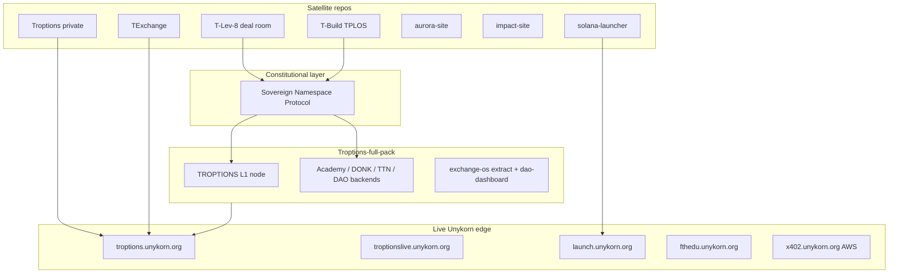

# FTH Trading / TROPTIONS ecosystem map

**Last verified:** 2026-05-21 (HTTP HEAD + `gh repo view` + local path scan)

This document is the **authoritative catalog** of repos, deploy surfaces, and how each piece connects to **Troptions-full-pack**. Re-run [`scripts/verify-ecosystem-links.ps1`](../../scripts/verify-ecosystem-links.ps1) before investor decks.

---

## Architecture (how pieces connect)

**SNP (Sovereign Namespace Protocol)** is the **constitutional layer**: post-quantum namespace roots, Dilithium5 verification, and stateless trust primitives referenced by L1 namespace migration (`scripts/migrate-namespaces-to-l1.py`), Exchange OS proof surfaces, and partner deal rooms. It is **not** a revenue product by itself — it governs **what names and claims are allowed** across the stack.

---

## Core repos (operator catalog)

| Repo | GitHub | Local path (if cloned) | Deploy / public URL | Status | Role & link to full-pack |
|------|--------|------------------------|---------------------|--------|---------------------------|
| **Troptions-full-pack** | [FTHTrading/Troptions-full-pack](https://github.com/FTHTrading/Troptions-full-pack) | `C:\Users\Kevan\Troptions-full-pack` | [GitHub Pages](https://fthtrading.github.io/Troptions-full-pack/) | **Pages LIVE** | Monorepo: Rust L1, Python backends, DAO, `frontends/exchange-os`, investor site → `docs/` |
| **sovereign-namespace-protocol** | [FTHTrading/sovereign-namespace-protocol](https://github.com/FTHTrading/sovereign-namespace-protocol) | *(not cloned on this machine)* | — | **GitHub public** | SNP v1.0 spec + verification; root trust for namespaces consumed by L1 and partner OS repos |
| **T-Lev-8-** | [FTHTrading/T-Lev-8-](https://github.com/FTHTrading/T-Lev-8-) | `C:\Users\Kevan\Documents\GitHub\T-Lev-8-` | [GitHub Pages](https://fthtrading.github.io/T-Lev-8-/) | **Pages LIVE** | RWA deal room, LEV8 gates; licensing surface adjacent to Exchange OS desk narrative |
| **T-Build** | [FTHTrading/T-Build](https://github.com/FTHTrading/T-Build) | `C:\Users\Kevan\Documents\UNYKORN_Ecosystem\T-Build` | — | **Local / sandbox** | TPLOS partner launch OS; sandbox for partner token launches (feeds launcher + Exchange OS patterns) |
| **Troptions** | [FTHTrading/Troptions](https://github.com/FTHTrading/Troptions) | `C:\Users\Kevan\troptions` | [Vercel](https://troptions.vercel.app) | **Private repo · Vercel LIVE** | Institutional Exchange OS source; `frontends/exchange-os` in full-pack is a synchronized extract |
| **TExchange** | [FTHTrading/TExchange](https://github.com/FTHTrading/TExchange) | *(not cloned)* | Vercel (project-specific) | **GitHub public** | Exchange variant / deployment lineage; shares Exchange OS architecture with Troptions |
| **aurora-site** | [FTHTrading/aurora-site](https://github.com/FTHTrading/aurora-site) | `C:\Users\Kevan\Documents\UNYKORN_Ecosystem\aurora-site` | [Pages](https://fthtrading.github.io/aurora-site/) · `aurora.unykorn.org` | **Pages LIVE · custom DNS ERR** | Aurora RWA portal (ESG / asset storytelling) |
| **impact-site** | [FTHTrading/impact-site](https://github.com/FTHTrading/impact-site) | `C:\Users\Kevan\Documents\UNYKORN_Ecosystem\impact-site` | `impact.unykorn.org` | **Custom DNS ERR · Pages 404** | Impact / ESG portal — repo exists; production Pages/DNS needs operator fix |
| **solana-launcher** | [FTHTrading/solana-launcher](https://github.com/FTHTrading/solana-launcher) | `C:\Users\Kevan\solana-launcher` *(verify remote)* | [launch.unykorn.org](https://launch.unykorn.org) | **Vercel/Unykorn LIVE** | SPL + NFT launcher SaaS; mint registry + system truth linked from Exchange OS nav |
| **UnyKorn-X402-aws** | [FTHTrading/UnyKorn-X402-aws](https://github.com/FTHTrading/UnyKorn-X402-aws) | `C:\Users\Kevan\UnyKorn-X402-aws` | [x402.unykorn.org/health](https://x402.unykorn.org/health) · [twin.unykorn.org](https://twin.unykorn.org) | **Public · LIVE AWS+CF** | Production x402 mesh + Apostle ATP; monorepo `backend/x402-gateway` is lightweight sidecar only |

---

## Live Unykorn surfaces (curl-verified 2026-05-21)

| URL | HTTP | Product name (investor language) |
|-----|------|----------------------------------|
| https://troptions.unykorn.org/troptions | 200 | Institutional brand hub |
| https://troptionsexchange.unykorn.org/exchange-os | 200 | Exchange OS control plane |
| https://troptionslive.unykorn.org/sports | 200 | Sports & event network (TTN / WC26) |
| https://launch.unykorn.org | 200 | Token & NFT launcher |
| https://fthedu.unykorn.org | 200 | Education platform (FTH Academy) |
| https://x402.unykorn.org/health | 200 | x402 payment mesh health (UnyKorn AWS + CF) |
| https://twin.unykorn.org | 522/timeout* | Digital twin — agent mesh demo (origin may be down; re-probe) |
| https://x402api.unykorn.org | timeout* | x402 API docs (re-probe before investor demos) |

\*Twin/API docs: intermittent at 2026-05-21 curl; health endpoint was stable.
| https://troptions.vercel.app | 200 | Troptions institutional preview (private repo deploy) |
| https://portfolio.unykorn.org | 200 | Portfolio & proof registry |
| https://goat.unykorn.org | 200 | GoatX token surface |
| https://whichway.live | 200 | WWAI guest OS |
| https://fifa.unykorn.org | 200 | WWAI FIFA host |

---

## NOT live (honest)

| Host / URL | HTTP | Notes |
|------------|------|-------|
| https://ai.troptions.org | ERR | DONK tutor — nginx template only in full-pack; use local quickstart or future DNS |
| https://ttn.troptions.org | ERR | TTN edge hostname not pointed; sports live on `troptionslive.unykorn.org` |
| https://dao.troptions.org | ERR | DAO dashboard public edge not deployed; `dao-service` local :8093 |
| https://aurora.unykorn.org | ERR | Custom domain not resolving; use GitHub Pages URL until DNS fixed |
| https://impact.unykorn.org | ERR | Custom domain not resolving; GitHub Pages project returns 404 — fix deploy branch |

---

## x402 payment mesh (UnyKorn — production)

| Component | Where it lives | Status |
|-----------|----------------|--------|
| **UnyKorn-X402-aws** | [github.com/FTHTrading/UnyKorn-X402-aws](https://github.com/FTHTrading/UnyKorn-X402-aws) | **Public** · LIVE AWS + Cloudflare |
| Public health | `https://x402.unykorn.org/health` | **LIVE** — gateway `x402_mode: live`, Apostle `chain_id: 7332` operational (curl 2026-05-21) |
| Digital twin | `https://twin.unykorn.org` | **LIVE\*** — agent mesh UI (origin flaky; 522 observed) |
| API docs | `https://x402api.unykorn.org` | **LIVE\*** — operator docs (probe before demos) |
| Credit gateway package | `packages/x402-credit-gateway` | Production edge (:4020) |
| AWS runbooks | `aws/X402_AWS_*.md` | EC2 + systemd + tunnel cutover |
| Monorepo sidecar | `Troptions-full-pack/backend/x402-gateway/` (:4020) | **On `main`** — lightweight proxy/staging; **not** the public mesh |

Pay-per-request for AI agents (HTTP 402, ATP, `X-Payment-Proof`) — **not** API-key billing. See [X402_INTEGRATION.md](X402_INTEGRATION.html).

Do **not** conflate monorepo `backend/x402-gateway` with `x402.unykorn.org` unless you deploy and point DNS yourself.

---

## Troptions-full-pack internal map

| Path | Investor-facing name | Connects to |
|------|---------------------|-------------|
| `l1/` | TROPTIONS L1 | SNP namespaces, RocksDB, treasury, DAO RPCs |
| `backend/fth-academy/` | Education platform backend | `fthedu.unykorn.org` |
| `backend/ttn-launcher/` | Broadcast / TTN registry | `troptionslive.unykorn.org` |
| `ai/donk-tutor/` | AI tutor (local) | Future `ai.troptions.org` |
| `backend/dao-service/` + `frontends/dao-dashboard/` | Governance | Future `dao.troptions.org` |
| `frontends/exchange-os/` | Exchange OS (extract) | Synced from private **Troptions** repo |
| `sites/investor/` | Investor showcase | Exports to `docs/` for Pages |
| `contracts/polygon/` | KENNY / EVL community assets | Proof docs + mainnet addresses in README |

---

## Additional FTHTrading repos discovered locally

Not in the original operator table but present under `C:\Users\Kevan` or GitHub org:

| Name | Notes |
|------|-------|
| `portfolio-unykorn` / **portfolio-** | Live https://portfolio.unykorn.org |
| `UnyKorn-X402-aws` | **Public** — production x402 mesh + Apostle on AWS (`aws/`, `proofs/`) |
| `fth-capital-os`, `fth-distribution-os`, `fth-operator-hub` | Capital / distribution operator tools |
| `unykorn-rwa-treasury-os`, `unykorn-asset-infrastructure-os` | RWA treasury & asset OS |
| `troptions-event-os`, `troptions-launch-os`, `troptions-partner-launch-os` | Event & launch automation |
| `needai-phone-service` skill path | NEED AI telecom (separate product line) |

---

## Gaps (action items)

1. Point **troptions.org** subdomains (`ai`, `ttn`, `dao`) or keep investor copy on **unykorn.org** only.
2. Fix **impact-site** GitHub Pages deploy (404) and **aurora/impact** custom DNS at `*.unykorn.org`.
3. Align **solana-launcher** local folder remote (operator machine may point at wrong origin — verify before edits).
4. Publish **T-Build** sandbox to a stable preview URL when TPLOS partners need demos.
5. Keep **Exchange desk $175M** and similar figures in **attestation / PENDING** truth labels until proofs land.

---

## Related docs

- [Domain truth table](DOMAIN_TRUTH_TABLE.html)
- [x402 integration (monorepo ↔ UnyKorn)](X402_INTEGRATION.html)
- [UNYKORN ecosystem map (layer detail)](UNYKORN-ECOSYSTEM-MAP.html)
- [Truth labels](../proof/truth-labels.html)
- [Investor site](https://fthtrading.github.io/Troptions-full-pack/) — section **FTH Ecosystem**
