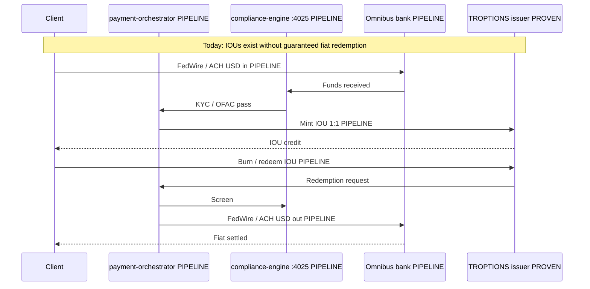
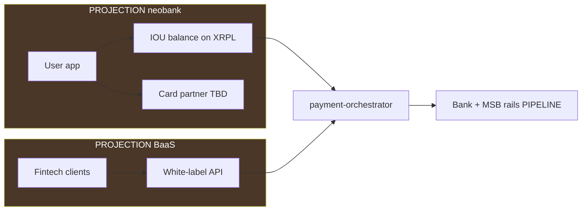

# MSB / fiat rails — IOU issuer capitalization tree

**Audience:** Investors and technical diligence.  
**Last updated:** 2026-05-21  
**Labels:** **PROVEN**, **PIPELINE**, **PROJECTION** — same definitions as [System manifest](SYSTEM_MANIFEST.html).

**Not legal advice.** Engineering and product roadmap only. MSB registration, SWIFT membership, and FedWire participation require licensed counsel and bank partners.

---

## Executive summary (IOU-first)

| Layer | Status | Label |
|-------|--------|-------|
| **~874M issued IOUs** (XRPL + Stellar) | Ledger-verified issuance | **PROVEN** — **demand/supply, not reserves** |
| USDC / USDT / DAI / EURC on XRPL | TROPTIONS-issued IOUs | **PROVEN** (IOU) — **not** Circle / Tether / Maker **native** tokens |
| Regulated 1:1 fiat redemption today | Not operational | **Not claimed** |
| Academy + launcher + x402 | Live commerce | **PROVEN** |
| MSB + omnibus + orchestrator | Stubs + docs | **PIPELINE** |
| SWIFT + FedWire | Designed; credentials TBD | **PIPELINE** |
| Revenue A–E (issuance, float, desk, B2B, WC26) | Requires backed rails | **PIPELINE** / scenario **PROJECTION** |
| Neobank + BaaS tables | Product design only | **PROJECTION** |
| Exchange desk ~$175M | Operator attestation | **PIPELINE** — **do not** cite as verified without bank statements |
| Funding plan $2M–$3.5M | Capitalization planning | **PROJECTION** |

**Investor one-liner:** Proven **~874M IOU demand** on ledger → **PIPELINE** converts to **legally-backed redeemable claims** when MSB + bank omnibus + FedWire/SWIFT are live — capturing fees A–E and optional neobank/BaaS (**PROJECTION**).

---

## Capitalization tree (honest)

```mermaid
flowchart TB
  ROOT[TROPTIONS platform]

  ROOT --> PROVEN_BLOCK[PROVEN today]
  ROOT --> PIPELINE_BLOCK[PIPELINE — rails + backing]
  ROOT --> PROJ_BLOCK[PROJECTION — products + scenarios]

  PROVEN_BLOCK --> P1[~874M issued IOUs — NOT bank reserves]
  PROVEN_BLOCK --> P2[Academy Stripe :8091]
  PROVEN_BLOCK --> P3[Launcher + x402 :8092 / :4020]
  PROVEN_BLOCK --> P4[XRPL issuer rJLMST… + Stellar mirror]
  PROVEN_BLOCK --> P5[Polygon KENNY / EVL / Genesis]

  PIPELINE_BLOCK --> L0[IOU = unfunded promise today]
  PIPELINE_BLOCK --> L1[MSB + BSA program]
  PIPELINE_BLOCK --> L2[Omnibus 1:1 reserve at bank]
  PIPELINE_BLOCK --> L3[compliance-engine :4025]
  PIPELINE_BLOCK --> L4[payment-orchestrator :4022]
  PIPELINE_BLOCK --> L5[swift-bridge + FedWire]
  PIPELINE_BLOCK --> L6[Redeemable claims + fee capture A–E]

  PROJ_BLOCK --> R1[Neobank on IOUs]
  PROJ_BLOCK --> R2[BaaS white-label]
  PROJ_BLOCK --> R3[Funding ask $5–10M]
```

---

## Fiat → IOU loop (target state)

---

## IOU honesty vs native stablecoins

| Question | Answer | Label |
|----------|--------|-------|
| Is XRPL “USDC” Circle USDC? | **No** — TROPTIONS gateway IOU using USDC currency code | **PROVEN** (issuer wallet) |
| Can holders redeem 1:1 USD today? | **Not claimed** — promise-to-pay until rails + reserve | **PIPELINE** |
| What does ~874M prove? | Wallets accepted **issued supply** — utility/demand signal | **PROVEN** |
| What does ~874M **not** prove? | Market cap, fully-backed reserves, $175M verified desk | **Do not claim** |

Full tables: [On-chain proof](ON_CHAIN_PROOF.html) · [XRPL verification](XRPL_STELLAR_VERIFICATION.html).

---

## Revenue A–E — label map

| Stream | Mechanism | Label when live in GL |
|--------|-----------|------------------------|
| **A** Issuance / redemption fees | Wire in/out ↔ mint/burn IOU | **PIPELINE** → **PROVEN** after first settled wire + fee |
| **B** Float margin | Omnibus yield − holder yield | **PIPELINE** |
| **C** Exchange / desk spread | Round-trip IOU desk | **PIPELINE** (desk attestation gated) |
| **D** Cross-border B2B | USD → IOU → EUR via SWIFT | **PIPELINE** |
| **E** WC26 / TTN commerce | Sponsor settlement | **PIPELINE** (tiers not signed) |

**PROVEN cash unrelated to A–E:** Academy, Solana launcher, x402 — see [System manifest](SYSTEM_MANIFEST.html).

**Scenario totals ($50M/mo vs $500M/mo IOU flow):** **PROJECTION** only — see [`TROPTIONS_IOU_ISSUER_MANIFEST.md`](../../TROPTIONS_IOU_ISSUER_MANIFEST.md).

---

## Rail-by-rail integration

### MSB (money services business)

| Item | Label | Monorepo hook |
|------|-------|---------------|
| FinCEN MSB registration | **PIPELINE** | Operator-held credentials |
| Transaction monitoring | **PIPELINE** | `fiat-rails/compliance-engine/` :4025 |
| KYC / CIP | **PIPELINE** | Env provider keys |
| SAR / CTR workflow | **PIPELINE** | `docs/compliance/` TBD |

### SWIFT

| Item | Label | Notes |
|------|-------|-------|
| BIC + RMA | **PIPELINE** | Correspondent required |
| MT103 / MT202 | **PIPELINE** | `swift-bridge` planned |
| Service bureau | **PIPELINE** | Third-party messaging |

### FedWire

| Item | Label | Notes |
|------|-------|-------|
| FedWire participation | **PIPELINE** | Bank-led |
| Same-day USD settlement | **PIPELINE** | After routing live |
| Operating procedures | **PIPELINE** | Participation package |

### Crypto rails (live)

| Rail | Label | Proof |
|------|-------|-------|
| XRPL IOU issuance | **PROVEN** | [XRPL & Stellar verification](XRPL_STELLAR_VERIFICATION.html) |
| Stellar mirror | **PROVEN** | Same |
| Polygon community + Genesis | **PROVEN** | [Genesis contracts](GENESIS_POLYGON_CONTRACTS.html) |
| x402 + Apostle ATP | **PROVEN** (health) | [x402 integration](X402_INTEGRATION.html) |

---

## Neobank & BaaS (**PROJECTION**)

All interchange, float, and BaaS platform fees in scenario tables stay **PROJECTION** until products ship and general ledger exists.

---

## Reserve & desk attestation

| Claim | Allowed label | Investor language |
|-------|---------------|-------------------|
| ~874M issued on ledger | **PROVEN** | IOU supply — proven demand, **not** bank AUM |
| Operator desk ~$175M USDC | **PIPELINE** | Attestation — **not** Circle native USDC |
| Fully reserved like a bank today | **Do not use** | Misleading |
| 274M USDC-labeled IOU issued | **PROVEN** (ledger) | Cross-chain IOU total |

**Verification path (PIPELINE):** correspondent statement → reconcile orchestrator → attestation memo (separate from on-chain supply).

---

## Funding ask (**PROJECTION**)

| Item | Amount | Label |
|------|--------|-------|
| MSB integration, bank omnibus, compliance, engineering, reserve seed | **$2M – $3.5M** planning range | **PROJECTION** |

Not an offering document. Use for internal capitalization discussions only.

---

## Week 1–4 operator checklist (condensed)

1. **Week 1:** MSB artifact vault; stub `fiat-rails` :4022–:4027; fix IOU vs Circle copy on investor surfaces
2. **Week 2:** Banking API behind feature flags; compliance provider env
3. **Week 3:** SWIFT skeleton; FedWire sandbox with bank
4. **Week 4:** Publish manifest + MSB rails to Pages; legal BSA review; **no** live neobank marketing

---

## Links

- [System manifest — IOU model + Mermaid](SYSTEM_MANIFEST.html)
- [On-chain proof](ON_CHAIN_PROOF.html)
- [Architecture](ARCHITECTURE.html)
- [Valuation & comparables](VALUATION_AND_COMPARABLES.html)
- GitHub: [Troptions-full-pack](https://github.com/FTHTrading/Troptions-full-pack)
