# MSB / fiat rails — capitalization & integration tree

**Audience:** Investors and technical diligence.  
**Last updated:** 2026-05-21  
**Labels:** **PROVEN**, **PIPELINE**, **PROJECTION** — same definitions as [System manifest](SYSTEM_MANIFEST.html).

**Not legal advice.** This is an engineering and product roadmap document. MSB registration, SWIFT membership, and FedWire participation require licensed counsel and bank partners.

---

## Executive summary

| Layer | Status | Label |
|-------|--------|-------|
| Crypto issuance & education commerce | Live products on unykorn.org + local PM2 | **PROVEN** |
| MSB compliance program + fiat orchestration | Stubs + docs in monorepo | **PIPELINE** |
| SWIFT cross-border + FedWire RTGS | Designed; credentials TBD | **PIPELINE** |
| Neobank / BaaS revenue | Scenario tables only | **PROJECTION** |
| ~$175M USDC desk (operator) | Attestation until FedWire + bank reporting | **PIPELINE** |
| Full-reserve settlement bank | **Not claimed as live** | — |

---

## Capitalization tree (honest)

```mermaid
flowchart TB
  ROOT[TROPTIONS / FTH platform equity narrative]

  ROOT --> PROVEN_BLOCK[PROVEN — deployed today]
  ROOT --> PIPELINE_BLOCK[PIPELINE — in build]
  ROOT --> PROJ_BLOCK[PROJECTION — if rails close]

  PROVEN_BLOCK --> P1[L1 node + DAO :9944 / :8093]
  PROVEN_BLOCK --> P2[Academy Stripe :8091 / fthedu]
  PROVEN_BLOCK --> P3[Launcher + x402 :8092 / :4020]
  PROVEN_BLOCK --> P4[~874M issued ledger utility — not AUM]
  PROVEN_BLOCK --> P5[Polygon / XRPL / Stellar proofs]

  PIPELINE_BLOCK --> L1[MSB registration + BSA program]
  PIPELINE_BLOCK --> L2[msb-compliance :4098]
  PIPELINE_BLOCK --> L3[payment-orchestrator :4022]
  PIPELINE_BLOCK --> L4[swift-bridge MT103/202]
  PIPELINE_BLOCK --> L5[FedWire RTGS + correspondent]
  PIPELINE_BLOCK --> L6[Desk USDC attestation → reserve path]

  PROJ_BLOCK --> R1[Neobank interchange]
  PROJ_BLOCK --> R2[BaaS API revenue]
  PROJ_BLOCK --> R3[Wire + FX fee scale scenarios]
```

---

## Rail-by-rail integration

### MSB (money services business)

| Item | Label | Monorepo hook |
|------|-------|---------------|
| FinCEN MSB registration | **PIPELINE** | Operator-held credentials; not in public git |
| Transaction monitoring | **PIPELINE** | `backend/msb-compliance/` — `/health` returns `pipeline` |
| KYC / CIP | **PIPELINE** | Provider keys via env (`OFAC_API_KEY`, etc.) |
| SAR / CTR workflow | **PIPELINE** | Policy docs TBD under `docs/compliance/` |

**MSB playbook concepts:** BSA officer appointment, risk assessment, audit program — all **PIPELINE** document slots listed in [System manifest](SYSTEM_MANIFEST.html).

### SWIFT

| Item | Label | Notes |
|------|-------|-------|
| BIC + RMA | **PIPELINE** | Correspondent relationship required |
| MT103 customer payments | **PIPELINE** | `swift-bridge` container (planned) |
| MT202 bank transfers | **PIPELINE** | Settlement legs to orchestrator |
| Service bureau SLA | **PIPELINE** | Third-party messaging — no counterparty names in public docs |

### FedWire

| Item | Label | Notes |
|------|-------|-------|
| FedWire participation | **PIPELINE** | Bank-led; not DIY from app code alone |
| Same-day USD settlement | **PIPELINE** | Orchestrator routes after routing number live |
| Security / operating procedures | **PIPELINE** | Required for participation package |

### Crypto rails (already live)

| Rail | Label | Proof |
|------|-------|-------|
| XRPL issuance | **PROVEN** | [XRPL & Stellar verification](XRPL_STELLAR_VERIFICATION.html) |
| Stellar mirror | **PROVEN** | Same |
| Polygon Genesis + community | **PROVEN** | [Genesis contracts](GENESIS_POLYGON_CONTRACTS.html) |
| x402 + Apostle ATP | **PROVEN** (health) / twin demo flaky | [x402 integration](X402_INTEGRATION.html) |

---

## Fiat ↔ crypto user journey (target state)

| Step | Today | Target | Label |
|------|-------|--------|-------|
| 1. KYC | Academy identity only | MSB CIP + sanctions | **PIPELINE** |
| 2. USD in | Stripe subscriptions | FedWire/ACH/SWIFT in | **PIPELINE** |
| 3. Screen | — | `msb-compliance :4098` | **PIPELINE** |
| 4. Route | Crypto via exchanges / trust lines | `payment-orchestrator :4022` | **PIPELINE** |
| 5. Crypto out | Wallets / DEX / IOU | Same + audit log | **PROVEN** (crypto) / **PIPELINE** (fiat out) |
| 6. USD out | — | FedWire/ACH out | **PIPELINE** |

---

## Reserve & desk attestation ($175M USDC)

| Claim | Allowed label | Investor language |
|-------|---------------|-------------------|
| Operator states desk aligns with ~$175M USDC | **PIPELINE** | "Operator attestation — verify when FedWire + correspondent statements available" |
| Issued ~874M on XRPL/Stellar | **PROVEN** (ledger) | Utility supply — **not** bank reserve proof |
| "Fully reserved like a bank" | **Do not use** | Misleading until audited reserve reports exist |

**Verification path (PIPELINE):** correspondent monthly statement → reconcile to orchestrator ledger → publish attestation memo (not on-chain supply).

---

## Revenue — what moves the label

| When booked in GL | Label becomes |
|-----------------|---------------|
| Academy Stripe charge settles | **PROVEN** (already) |
| First live FedWire in with bank confirmation | **PROVEN** (wire fees) — requires ops evidence |
| SWIFT MT103 settled with tracking ID | **PROVEN** (cross-border) |
| Neobank card interchange without product | stays **PROJECTION** |

All neobank/BaaS tables in [System manifest](SYSTEM_MANIFEST.html) remain **PROJECTION** until products and books exist.

---

## Week 1–4 operator checklist (condensed)

1. **Week 1:** MSB artifact vault, stub health checks `:4098` / `:4022`, PM2 `docs:update`
2. **Week 2:** Banking API contracts behind feature flags; compliance provider env
3. **Week 3:** SWIFT container skeleton; FedWire sandbox tests with bank
4. **Week 4:** Investor Pages publish; legal review BSA pack; no live neobank marketing

---

## Links

- [System manifest — full port map](SYSTEM_MANIFEST.html)
- [Architecture](ARCHITECTURE.html)
- [Quickstart](QUICKSTART.html)
- [On-chain proof](ON_CHAIN_PROOF.html)
- [Valuation & comparables](VALUATION_AND_COMPARABLES.html)
- GitHub: [Troptions-full-pack](https://github.com/FTHTrading/Troptions-full-pack)
