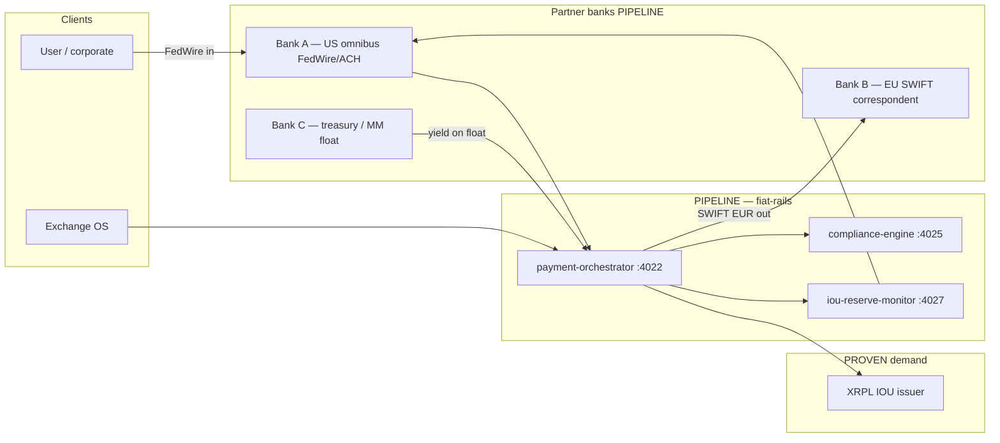

# Multi-bank partner mesh & cross-border settlement

**Last updated:** 2026-05-21  
**Labels:** **PROVEN** (repo/orchestrator code), **PIPELINE** (bank credentials), **PROJECTION** (scenario tables, Alexandrite fast-money).

**Related:** [System manifest](SYSTEM_MANIFEST.html) · [MSB fiat rails](MSB_FIAT_RAILS.html) · [IOU issuer manifest v3.0](../TROPTIONS_IOU_ISSUER_MANIFEST.md)

**Not legal advice.** Correspondent banking requires licensed counsel and executed bank agreements.

---

## Purpose

Describe how TROPTIONS routes fiat across **multiple partner banks** while IOUs settle on XRPL/Stellar. This is the target operating model — not a claim that all banks are live today.

---

## Mesh topology (**PIPELINE** target)

---

## Partner roles (illustrative)

| Bank slot | Function | Rails | Label |
|-----------|----------|-------|-------|
| **A** | US MSB omnibus — primary USD in/out | FedWire, ACH | **PIPELINE** |
| **B** | EU correspondent — EUR settlement | SWIFT MT103/202 | **PIPELINE** |
| **C** | Treasury / money-market — float yield | Internal transfer | **PIPELINE** |
| **Backup** | Failover omnibus (disaster) | FedWire | **PROJECTION** |

Bank legal names and account numbers live in **operator vault only** — never in git.

---

## Cross-bank settlement flow

1. **USD in (Bank A):** FedWire credited to omnibus → webhook → `POST /api/v1/payments/wire` → compliance `/screen` → FedWire `/verify` → mint IOU 1:1 (**PIPELINE** until live).
2. **Internal mesh (A↔C):** Move float for yield without client IOU movement (**PIPELINE**).
3. **EUR out (Bank B):** Burn IOU → orchestrator → SWIFT via `swift-bridge` :4024 (**PIPELINE**).
4. **Reconciliation:** `iou-reserve-monitor` compares omnibus statements vs on-chain supply (**PIPELINE** → **PROVEN** when attestations published).

---

## Alexandrite fast-money table (**PROJECTION**)

RWA collateral playbook for AXL001 — gem package described in Exchange OS; **not** audited NAV.

| Phase | Activity | Time (**PROJECTION**) | Label |
|-------|----------|----------------------|-------|
| T0 | Collateral custody + appraisal on file | 2–4 weeks | **PROJECTION** |
| T1 | Issue AXL001 receipt IOU (gated) | 1 day | **PIPELINE** |
| T2 | Lender FedWire → mint USD IOU to borrower | Same day | **PIPELINE** |
| T3 | Servicing / interest via orchestrator ledger | Ongoing | **PIPELINE** |
| T4 | Repay → burn IOU → wire out | 1–2 FedWire cycles | **PIPELINE** |
| T5 | Default → off-chain UCC sale | Case-by-case | **PROJECTION** |

| Metric | Illustrative value | Label |
|--------|-------------------|-------|
| Collateral (operator mark) | 2kg Alexandrite ~$12.5M | **PROJECTION** |
| LTV band | 40–60% | **PROJECTION** |
| Advance range | $5.0M – $7.5M | **PROJECTION** |
| IOU fee on wire-in | 0.1–0.25% | **PIPELINE** |

---

## API hooks (orchestrator)

| Endpoint | Service | Label |
|----------|---------|-------|
| `POST /api/v1/payments/wire` | payment-orchestrator | **PIPELINE** (implemented) |
| `GET /api/v1/payments/:id` | payment-orchestrator | **PIPELINE** |
| `POST /screen` | compliance-engine :4025 | **PIPELINE** |
| `POST /verify` | fedwire-adapter :4023 | **PIPELINE** |

---

## Honesty checklist

- Do **not** claim multi-bank mesh is live without executed correspondent agreements.
- Do **not** mix **PROJECTION** gem marks with **PROVEN** ledger IOU supply.
- Publish reserve attestations separately from marketing manifests.
