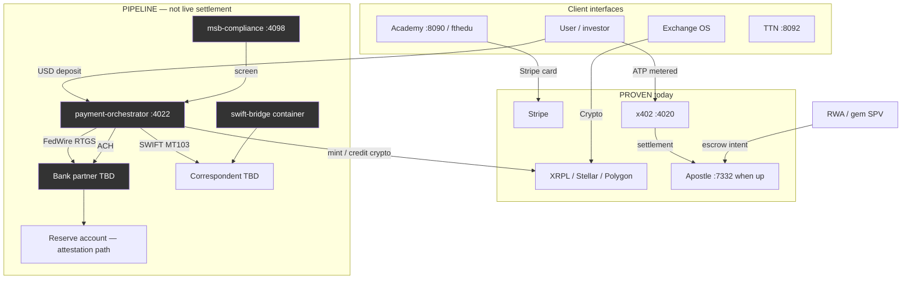
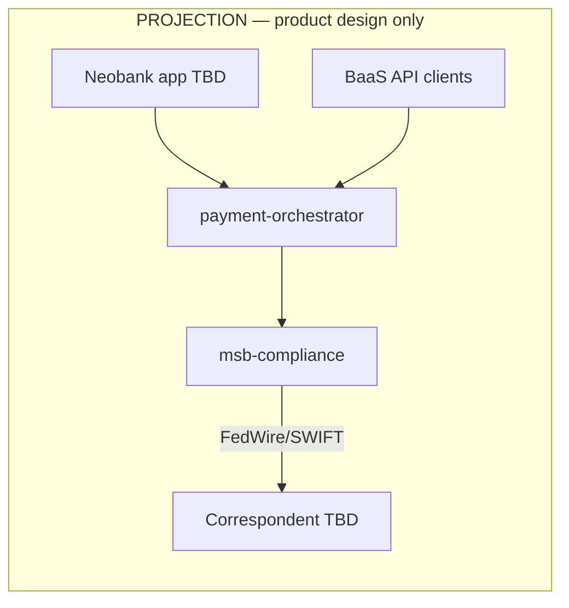

# TROPTIONS system manifest — MSB / SWIFT / FedWire integration map

**Last updated:** 2026-05-21 (auto-sync via `npm run docs:update`)  
**Labels:** **PROVEN** (repo + live HTTP/explorer), **PIPELINE** (designed, stub, or awaiting credentials), **PROJECTION** (illustrative scenarios — not forecasts or audited financials).

**Honesty:** This monorepo is **not** a live full-reserve settlement institution. Fiat banking rails (MSB registration, SWIFT, FedWire) and correspondent settlement are **PIPELINE** until wired and verified. Do **not** present issued ledger supply or operator desk attestations as booked bank reserves.

**Related docs:** [Architecture](ARCHITECTURE.html) · [Quickstart](QUICKSTART.html) · [MSB fiat rails](MSB_FIAT_RAILS.html) · [Domain truth table](DOMAIN_TRUTH_TABLE.html) · [Valuation & comparables](VALUATION_AND_COMPARABLES.html)

---

## PM2 service map

Source of truth: `ecosystem.config.js` at repo root. Regenerate the port table with `python scripts/generate-system-manifest.py` or `npm run docs:update`.

<!-- AUTO:PM2_PORTS_START -->
| PM2 name | Port | Label | Path | Notes |
|----------|------|-------|------|-------|
| `troptions-l1-node` | **9944** (RPC), **9945** (`/metrics`) | **PROVEN** | `l1/` | Rust L1; local/operator host |
| `donk-ai-tutor` | **8090** | **PROVEN** | `ai/donk-tutor/` | RAG + Ollama |
| `fth-backend` | **8091** | **PROVEN** | `backend/fth-academy/` | Academy API + Stripe patterns |
| `ttn-launcher` | **8092** | **PROVEN** | `backend/ttn-launcher/` | TTN / sports backend |
| `dao-service` | **8093** | **PROVEN** | `backend/dao-service/` | Governance API |
| `x402-gateway` | **4020** | **PROVEN** | `backend/x402-gateway/` | Metered ATP sidecar; [x402 health](https://x402.unykorn.org/health) |
| `popeye-relay` | **4021** | **PROVEN** | `backend/popeye-relay/` | Stale agent relay |
| `payment-orchestrator` | **4022** | **PIPELINE** | `backend/payment-orchestrator/` | Fiat/crypto routing stub; `autorestart: false` |
| `msb-compliance` | **4098** | **PIPELINE** | `backend/msb-compliance/` | AML/KYC/OFAC stub; `autorestart: false` |
| `swift-bridge` | *(container)* | **PIPELINE** | `backend/swift-bridge/` *(planned)* | MT103/202 — not in PM2 until image exists |
<!-- AUTO:PM2_PORTS_END -->

**Port check:** `popeye-relay` uses **4021**; `payment-orchestrator` **4022** does not conflict. **4098** is reserved for `msb-compliance` and is not used elsewhere in this repo.

---

## Banking rails status

| Rail | Capability | Label | Verification path |
|------|------------|-------|-------------------|
| **MSB (FinCEN MSB registration)** | Fiat remittance / money transmission compliance program | **PIPELINE** | License upload + policy pack in repo; FinCEN Form 107 not claimed live here |
| **SWIFT** | Cross-border MT103/MT202 messaging | **PIPELINE** | BIC + service bureau credentials; `swift-bridge` container TBD |
| **FedWire** | USD RTGS settlement | **PIPELINE** | Routing + participation agreement; same-day USD not live until bank partner confirms |
| **ACH (bank partner)** | Retail/bulk ACH | **PIPELINE** | Via correspondent — not standalone in monorepo |
| **Stripe (Academy)** | Card subscriptions | **PROVEN** | [fthedu.unykorn.org](https://fthedu.unykorn.org) |
| **x402 / Apostle ATP** | Agent metered settlement | **PROVEN** (health) | `:4020` sidecar; Apostle **7332** when operator runs chain |

### $175M USDC desk attestation

| Item | Label | Notes |
|------|-------|-------|
| Operator-reported ~$175M USDC desk alignment | **PIPELINE** | **Operator attestation only** until FedWire + correspondent reserve reporting is live |
| On-chain issued supply (~874M IOU utility) | **PROVEN** (ledger) | **Not** bank reserve, market cap, or audited AUM — see [ON_CHAIN_PROOF](ON_CHAIN_PROOF.html) |
| Full-reserve settlement institution | **Not claimed** | Do not market as live fact |

---

## Revenue model

### PROVEN (cash-real or live product today)

| Stream | Label | Model | Evidence |
|--------|-------|-------|----------|
| FTH Academy | **PROVEN** | $19 / $49 / $149 tiers | [fthedu.unykorn.org](https://fthedu.unykorn.org) |
| Solana launcher SaaS | **PROVEN** | Per-launch fees | [launch.unykorn.org](https://launch.unykorn.org) |
| x402 metered APIs | **PROVEN** | ATP on Apostle | [x402.unykorn.org/health](https://x402.unykorn.org/health) |
| Cross-chain issuance utility | **PROVEN** | Trust lines / issuance | XRPL + Stellar + Polygon proofs in technical pack |
| DAO governance API | **PROVEN** | Platform tooling | `dao-service` + [Pages /dao/](../dao/) |

**Honest cash today:** early-scale Academy + launcher + x402 — not MSB wire volume or neobank interchange.

### PIPELINE (designed; not booked)

| Stream | Label | Notes |
|--------|-------|-------|
| MSB wire / remittance fees | **PIPELINE** | After compliance engine + orchestrator wired |
| SWIFT cross-border fees | **PIPELINE** | After `swift-bridge` + correspondent |
| FedWire RTGS fees | **PIPELINE** | After bank partner + routing |
| Exchange OS fiat on-ramp | **PIPELINE** | [troptionsexchange.unykorn.org](https://troptionsexchange.unykorn.org/exchange-os) UI **PROVEN**; fiat rail **PIPELINE** |
| TTN / WC26 sponsorship | **PIPELINE** | Tiers documented; not signed revenue |
| RWA / gem tokenization desk | **PIPELINE** | Plug-and-play manifest AI — see repo `scripts/plug_and_play_*.py` |

### PROJECTION — illustrative only (not forecasts)

*Disclaimer: Tables below are strategic scenarios if fiat rails and neobank/BaaS products launch. They are **not** audited financials, registered offerings, or guarantees.*

**Conservative scenario (monthly)**

| Stream | PROJECTION $/mo | Basis (illustrative) |
|--------|-----------------|----------------------|
| Exchange fees | $30K | $10M volume × 0.3% |
| Stablecoin issuance fee | $25K | $10M × 0.25% |
| Wire fees | $5K | 200 × $25 |
| B2B payments | $20K | 10 × $2K |
| Neobank interchange | $75K | 10K users × $500 spend × 1.5% |
| Subscriptions | $20K | 2K × $10 |
| Lending margin | $80K | $30M deposits × 3.2% spread |
| BaaS platform fees | $50K | 5 × $10K |
| **Total** | **~$305K/mo** | **~$3.6M/yr scenario** |

**Scale scenario (monthly)**

| Stream | PROJECTION $/mo |
|--------|-----------------|
| Exchange + issuance + wires + B2B + neobank + subs + lending + BaaS | **~$2.6M/mo** |

See [Valuation & comparables](VALUATION_AND_COMPARABLES.html) for maturity score and comparable framing.

---

## Fiat → crypto flow (PROVEN paths + PIPELINE extensions)



---

## Neobank / BaaS optional future (PROJECTION)



Interchange, lending margin, and BaaS rows in revenue tables are **PROJECTION** until products ship and GL exists.

---

## Integration checklist (weeks 1–4)

### Week 1 — Foundation

- [ ] **PIPELINE:** Upload MSB registration artifacts to secure operator store (not public repo secrets)
- [ ] **PIPELINE:** Stand up `msb-compliance` stub health on `:4098`; wire env template
- [ ] **PIPELINE:** Stand up `payment-orchestrator` stub on `:4022`
- [ ] **PROVEN:** Confirm existing PM2 stack (`8090–8093`, `4020–4021`, `9944`) via [Quickstart](QUICKSTART.html)
- [ ] Document reserve attestation path for desk USDC (**PIPELINE** until FedWire live)

### Week 2 — Orchestration

- [ ] **PIPELINE:** `POST /api/banking/deposit` contract (stub → orchestrator)
- [ ] **PIPELINE:** Connect Exchange OS fiat intents to orchestrator (feature flag)
- [ ] **PIPELINE:** OFAC/KYC provider keys in env (no keys in git)
- [ ] **PROVEN:** Regression x402 + dao health probes

### Week 3 — SWIFT + FedWire

- [ ] **PIPELINE:** `swift-bridge` container skeleton + MT103/202 schema docs
- [ ] **PIPELINE:** FedWire routing + limits in orchestrator config
- [ ] **PIPELINE:** End-to-end test plan (sandbox wires only)
- [ ] Update this manifest via `npm run docs:update`

### Week 4 — Investor + compliance pack

- [ ] Publish [MSB_FIAT_RAILS](MSB_FIAT_RAILS.html) to GitHub Pages
- [ ] **PIPELINE:** BSA/AML policy manual draft in repo (legal review required)
- [ ] **PROJECTION:** Neobank prototype scope doc only — no live interchange claims
- [ ] Re-run domain + truth label scripts before external meetings

---

## Document manifest (compliance artifacts)

| Artifact | MSB | FedWire | SWIFT | Label |
|----------|-----|---------|-------|-------|
| FinCEN Form 107 / registration | Required | — | — | **PIPELINE** |
| BSA/AML policy manual | Required | — | — | **PIPELINE** |
| KYC / CIP procedures | Required | — | — | **PIPELINE** |
| SAR / CTR procedures | Required | — | — | **PIPELINE** |
| FedWire participation + security proc | — | Required | — | **PIPELINE** |
| SWIFT RMA + bilateral keys | — | — | Required | **PIPELINE** |
| MT103/202 message specs | — | — | Required | **PIPELINE** |

Plug-and-play document AI: `scripts/plug_and_play_system.py` — categorizes uploads; does **not** replace legal review.

---

## API surface (PIPELINE contracts)

```
POST /api/banking/deposit      # PIPELINE
POST /api/banking/withdraw     # PIPELINE
POST /api/banking/transfer     # PIPELINE
GET  /api/banking/balance      # PIPELINE
POST /api/compliance/screen    # PIPELINE — msb-compliance :4098
POST /api/compliance/kyc       # PIPELINE
POST /api/swift/send           # PIPELINE — swift-bridge
GET  /api/swift/status/:id     # PIPELINE
```

---

## Technical index

| Doc | Purpose |
|-----|---------|
| [SYSTEM_MANIFEST](SYSTEM_MANIFEST.html) | This file — ports, rails, revenue honesty |
| [MSB_FIAT_RAILS](MSB_FIAT_RAILS.html) | Investor capitalization tree |
| [ARCHITECTURE](ARCHITECTURE.html) | Layer diagram + data flows |
| [QUICKSTART](QUICKSTART.html) | Local PM2 bring-up |
| [PLUG_AND_PLAY](../../TROPTIONS_PLUG_AND_PLAY_SYSTEM.md) | Document manifest AI (repo root) |

*Generated port rows sync from `ecosystem.config.js`. Manual prose sections are edited in this file.*
