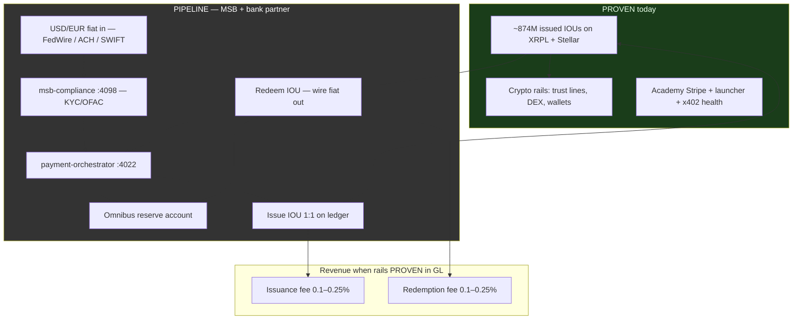
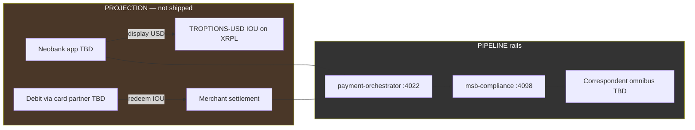
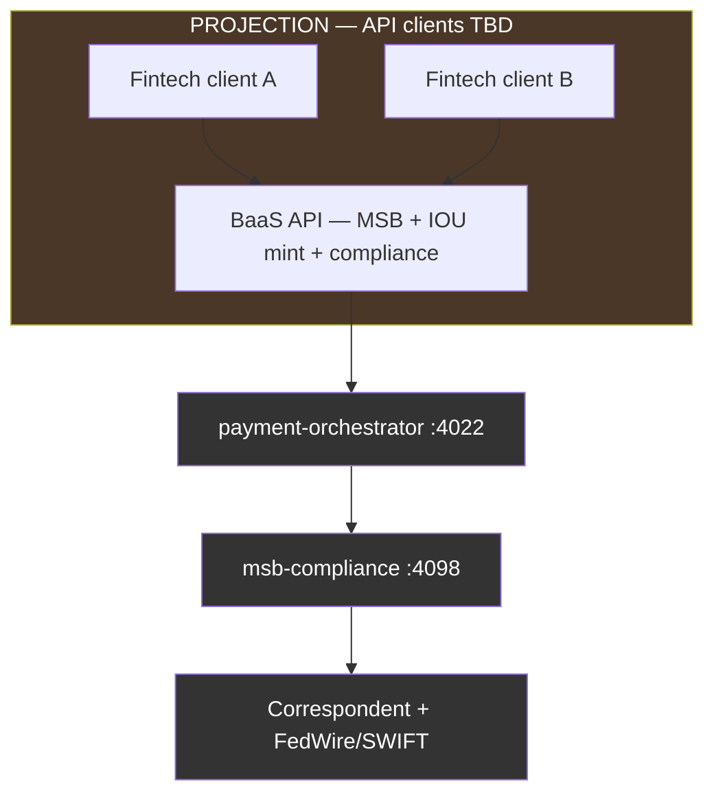
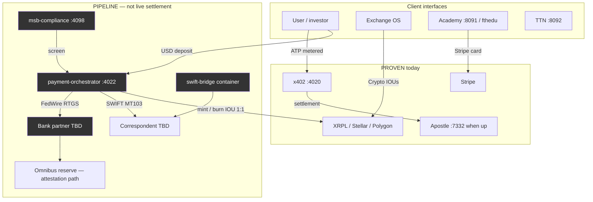

# TROPTIONS system manifest — IOU issuer model & MSB / SWIFT / FedWire map

**Last updated:** 2026-05-21 (auto-sync via `npm run docs:update`)  
**Labels:** **PROVEN** (repo + live HTTP/explorer), **PIPELINE** (designed, stub, or awaiting credentials), **PROJECTION** (illustrative scenarios — not forecasts or audited financials).

**Related docs:** [MSB fiat rails](MSB_FIAT_RAILS.html) · [On-chain proof](ON_CHAIN_PROOF.html) · [XRPL & Stellar verification](XRPL_STELLAR_VERIFICATION.html) · [Architecture](ARCHITECTURE.html) · [Valuation & comparables](VALUATION_AND_COMPARABLES.html)

---

## IOU issuer model (read this first)

### What is on ledger today (**PROVEN**)

| Fact | Label | Investor language |
|------|-------|-------------------|
| **~874M** units issued on XRPL + Stellar (TROPTIONS, USDC, USDT, EURC, DAI **currency codes**) | **PROVEN** (ledger) | **Issued supply / proven demand** — wallets hold trust-line IOUs |
| Issuer wallets `rJLMST…` / `GB4FHG…` | **PROVEN** | TROPTIONS gateway issues these IOUs |
| USDC / USDT / DAI / EURC on XRPL | **PROVEN** (IOU) | **TROPTIONS-issued IOUs** — **not** Circle, Tether, or Maker **native** mainnet tokens |
| Regulated 1:1 fiat redemption today | **Not claimed** | **Unfunded promise-to-pay** until omnibus + reserve path is live |
| Market cap, AUM, or fully-backed bank reserves | **Do not use** | Issued supply ≠ USD in bank |

**Honesty:** This monorepo is **not** a live full-reserve settlement institution. Fiat banking rails (MSB registration, SWIFT, FedWire) and correspondent omnibus accounts are **PIPELINE** until wired and verified. Do **not** present issued ledger supply or operator desk attestations as booked bank reserves.

### What MSB + SWIFT + FedWire unlock (**PIPELINE** → future **PROVEN**)

| Capability | Label | Outcome when live |
|------------|-------|-------------------|
| FinCEN MSB program + BSA/AML | **PIPELINE** | Legal money-transmission posture |
| FedWire / ACH / SWIFT in | **PIPELINE** | Fiat lands in partner omnibus |
| `msb-compliance` :4098 + `payment-orchestrator` :4022 | **PIPELINE** | Screen, route, mint/burn IOUs 1:1 against fiat |
| Redeemable digital-dollar claims | **PIPELINE** | IOUs backed by **audited** reserve reporting — not marketing copy |

**Shift:** unfunded operator attestation → **legally-backed redeemable claims** (only after bank + compliance evidence exists).

### Operator desk (~$175M) — do not over-claim

| Item | Label | Notes |
|------|-------|-------|
| Exchange OS desk ~$175M USDC narrative | **PIPELINE** | **Operator attestation only** — not Circle USDC, not verified without correspondent statements |
| On-chain **274M** USDC-labeled IOU issued (XRPL+Stellar) | **PROVEN** (ledger) | IOU supply — **not** $175M verifiable desk without rails |
| Full-reserve institution live today | **Not claimed** | — |

---

## Fiat → IOU issuance & redemption loop



**Today:** loop is **open** between fiat and IOU — issuance/redemption fees are **PIPELINE**, not booked revenue.

---

## Revenue streams A–E (issuer edition)

*Scenario math below is **PIPELINE** or **PROJECTION** until fiat rails and GL exist. **PROVEN** cash today is Academy + launcher + x402 (see bottom).*

| Stream | Description | Label | Notes |
|--------|-------------|-------|-------|
| **A** | Issuance & redemption fees (wire in → mint IOU; burn → wire out) | **PIPELINE** | 0.1–0.25% illustrative; requires omnibus + MSB |
| **B** | Float income (reserve yield minus holder yield) | **PIPELINE** | Bank-model margin — **not** live |
| **C** | Exchange / desk round-trip spread | **PIPELINE** | Desk attestation gated; not $175M verified fact |
| **D** | Cross-border B2B (USD in → IOU → EUR out via SWIFT) | **PIPELINE** | SWIFT + correspondent **PIPELINE** |
| **E** | WC26 / TTN commerce (sponsor wire → IOU / $LEV8 settlement) | **PIPELINE** | Sponsorship tiers documented; **not signed revenue** |

**Illustrative scale (PIPELINE / PROJECTION — not forecasts):**

| Scenario | A + B + C + D + E (illustrative) | Label |
|----------|----------------------------------|-------|
| $50M/mo IOU flow through backed rails | ~$578K/mo scenario | **PROJECTION** |
| $500M/mo IOU flow | ~$4.9M/mo scenario | **PROJECTION** |

See repo root [`TROPTIONS_IOU_ISSUER_MANIFEST.md`](../../TROPTIONS_IOU_ISSUER_MANIFEST.md) for full scenario tables.

### PROVEN revenue & demand (today)

| Item | Label | Evidence |
|------|-------|----------|
| ~874M issued IOUs | **PROVEN** (demand/supply) | [ON_CHAIN_PROOF](ON_CHAIN_PROOF.html) — **not** revenue |
| FTH Academy | **PROVEN** | [fthedu.unykorn.org](https://fthedu.unykorn.org) |
| Solana launcher SaaS | **PROVEN** | [launch.unykorn.org](https://launch.unykorn.org) |
| x402 metered APIs | **PROVEN** (health) | [x402.unykorn.org/health](https://x402.unykorn.org/health) |
| DAO governance API | **PROVEN** | `dao-service` :8093 |
| Cross-chain issuance utility | **PROVEN** | XRPL + Stellar + Polygon proofs |

**Honest cash today:** early-scale Academy + launcher + x402 — **not** MSB wire volume, float, neobank interchange, or BaaS platform fees.

---

## Neobank — thin layer on IOUs (**PROJECTION**)

*Disclaimer: Product design only. No live interchange, card program, or deposit insurance claims.*



| Neobank line (illustrative) | 10K users scenario | 100K users scenario | Label |
|----------------------------|-------------------|---------------------|-------|
| Interchange ~1.5% | $75K/mo | $750K/mo | **PROJECTION** |
| Premium subs | $10K/mo | $100K/mo | **PROJECTION** |
| Float margin | $80K/mo | $400K/mo | **PROJECTION** |
| Card fees | $5K/mo | $50K/mo | **PROJECTION** |
| **Neobank subtotal** | **~$170K/mo** | **~$1.3M/mo** | **PROJECTION** |

---

## BaaS — white-label rails (**PROJECTION**)



| BaaS scenario | Illustrative $/mo | Label |
|---------------|---------------------|-------|
| 5 clients × ~$10K platform | $50K | **PROJECTION** |
| 50 clients × ~$10K | $500K | **PROJECTION** |

---

## Funding ask (**PROJECTION** / planning)

| Item | Range | Label | Use of funds (planning) |
|------|-------|-------|-------------------------|
| MSB + bank + compliance integration | **$5M – $10M** | **PROJECTION** | Omnibus setup, legal, engineering, reserve seed — **not** an offering term sheet |

---

## Legacy scenario tables (PROJECTION only)

*Superseded for investor meetings by A–E above; kept for sensitivity modeling.*

**Conservative scenario (monthly) — PROJECTION**

| Stream | PROJECTION $/mo | Basis (illustrative) |
|--------|-----------------|----------------------|
| Exchange fees | $30K | $10M volume × 0.3% |
| Stablecoin issuance fee | $25K | $10M × 0.25% |
| Wire fees | $5K | 200 × $25 |
| B2B payments | $20K | 10 × $2K |
| Neobank interchange | $75K | 10K users × $500 spend × 1.5% |
| Subscriptions | $20K | 2K × $10 |
| Lending margin | $80K | $30M deposits × 3.2% spread |
| BaaS platform fees | $50K | 5 × $10K |
| **Total** | **~$305K/mo** | **~$3.6M/yr scenario** |

**Scale scenario (monthly) — PROJECTION:** combined rows **~$2.6M/mo** — see [Valuation & comparables](VALUATION_AND_COMPARABLES.html).

---

## PM2 service map

Source of truth: `ecosystem.config.js` at repo root. Regenerate the port table with `python scripts/generate-system-manifest.py` or `npm run docs:update`.

<!-- AUTO:PM2_PORTS_START -->
| PM2 name | Port | Label | Path | Notes |
|----------|------|-------|------|-------|
| `troptions-l1-node` | **9944** (RPC), **9945** (`/metrics`) | **PROVEN** | `l1/` | Rust L1; local/operator host |
| `donk-ai-tutor` | **8090** | **PROVEN** | `ai/donk-tutor/` | RAG + Ollama |
| `fth-backend` | **8091** | **PROVEN** | `backend/fth-academy/` | Academy API + Stripe patterns |
| `ttn-launcher` | **8092** | **PROVEN** | `backend/ttn-launcher/` | TTN / sports backend |
| `dao-service` | **8093** | **PROVEN** | `backend/dao-service/` | Governance API |
| `x402-gateway` | **4020** | **PROVEN** | `backend/x402-gateway/` | Metered ATP sidecar; [x402 health](https://x402.unykorn.org/health) |
| `popeye-relay` | **4021** | **PROVEN** | `backend/popeye-relay/` | Stale agent relay |
| `payment-orchestrator` | **4022** | **PIPELINE** | `backend/payment-orchestrator/` | Fiat/crypto routing stub; `autorestart: false` |
| `msb-compliance` | **4098** | **PIPELINE** | `backend/msb-compliance/` | AML/KYC/OFAC stub; `autorestart: false` |
| `swift-bridge` | *(container)* | **PIPELINE** | `backend/swift-bridge/` *(planned)* | MT103/202 — not in PM2 until image exists |
<!-- AUTO:PM2_PORTS_END -->

**Port check:** `popeye-relay` uses **4021**; `payment-orchestrator` **4022** does not conflict. **4098** is reserved for `msb-compliance`.

---

## Banking rails status

| Rail | Capability | Label | Verification path |
|------|------------|-------|-------------------|
| **MSB (FinCEN MSB registration)** | Fiat remittance / money transmission compliance program | **PIPELINE** | License upload + policy pack in repo; Form 107 not claimed live here |
| **SWIFT** | Cross-border MT103/MT202 messaging | **PIPELINE** | BIC + service bureau credentials; `swift-bridge` container TBD |
| **FedWire** | USD RTGS settlement | **PIPELINE** | Routing + participation agreement; same-day USD not live until bank partner confirms |
| **ACH (bank partner)** | Retail/bulk ACH | **PIPELINE** | Via correspondent — not standalone in monorepo |
| **Stripe (Academy)** | Card subscriptions | **PROVEN** | [fthedu.unykorn.org](https://fthedu.unykorn.org) |
| **x402 / Apostle ATP** | Agent metered settlement | **PROVEN** (health) | `:4020` sidecar; Apostle **7332** when operator runs chain |

---

## Fiat ↔ crypto (PROVEN crypto + PIPELINE fiat)



---

## Integration checklist (weeks 1–4)

### Week 1 — Foundation

- [ ] **PIPELINE:** MSB artifacts in secure operator store (not public git secrets)
- [ ] **PIPELINE:** `msb-compliance` :4098 and `payment-orchestrator` :4022 stub health
- [ ] **PROVEN:** PM2 stack (`8090–8093`, `4020–4021`, `9944`) via [Quickstart](QUICKSTART.html)
- [ ] Document IOU vs native stablecoin language in investor + Exchange OS copy

### Week 2 — Orchestration

- [ ] **PIPELINE:** `POST /api/banking/deposit` / withdraw contracts
- [ ] **PIPELINE:** Exchange OS fiat intents → orchestrator (feature flag)
- [ ] **PROVEN:** Regression x402 + dao health probes

### Week 3 — SWIFT + FedWire

- [ ] **PIPELINE:** `swift-bridge` skeleton; FedWire sandbox with bank
- [ ] Update manifest via `npm run docs:update`

### Week 4 — Investor pack

- [ ] Publish [MSB_FIAT_RAILS](MSB_FIAT_RAILS.html) to GitHub Pages
- [ ] **PROJECTION:** Neobank / BaaS scope docs only — no live interchange claims
- [ ] Re-run truth labels before external meetings

---

## Document manifest (compliance artifacts)

| Artifact | MSB | FedWire | SWIFT | Label |
|----------|-----|---------|-------|-------|
| FinCEN Form 107 / registration | Required | — | — | **PIPELINE** |
| BSA/AML policy manual | Required | — | — | **PIPELINE** |
| KYC / CIP procedures | Required | — | — | **PIPELINE** |
| SAR / CTR procedures | Required | — | — | **PIPELINE** |
| FedWire participation + security proc | — | Required | — | **PIPELINE** |
| SWIFT RMA + bilateral keys | — | — | Required | **PIPELINE** |
| MT103/202 message specs | — | — | Required | **PIPELINE** |

Plug-and-play document AI: `scripts/plug_and_play_system.py` — does **not** replace legal review.

---

## API surface (PIPELINE contracts)

```
POST /api/banking/deposit      # PIPELINE
POST /api/banking/withdraw     # PIPELINE
POST /api/banking/transfer     # PIPELINE
GET  /api/banking/balance      # PIPELINE
POST /api/compliance/screen    # PIPELINE — msb-compliance :4098
POST /api/compliance/kyc       # PIPELINE
POST /api/swift/send           # PIPELINE — swift-bridge
GET  /api/swift/status/:id     # PIPELINE
```

---

## Technical index

| Doc | Purpose |
|-----|---------|
| [SYSTEM_MANIFEST](SYSTEM_MANIFEST.html) | This file — IOU model, revenue A–E, rails |
| [MSB_FIAT_RAILS](MSB_FIAT_RAILS.html) | Capitalization tree + investor summary |
| [ON_CHAIN_PROOF](ON_CHAIN_PROOF.html) | Explorer tables + IOU honesty |
| [XRPL_STELLAR_VERIFICATION](XRPL_STELLAR_VERIFICATION.html) | Live issuance verification |
| [ARCHITECTURE](ARCHITECTURE.html) | Layer diagram |
| [PLUG_AND_PLAY](../../TROPTIONS_PLUG_AND_PLAY_SYSTEM.md) | Document manifest AI |

*PM2 port rows sync from `ecosystem.config.js`. IOU/revenue prose edited in this file.*
