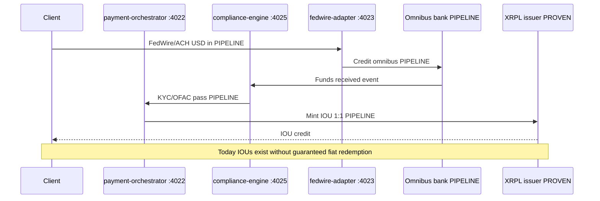
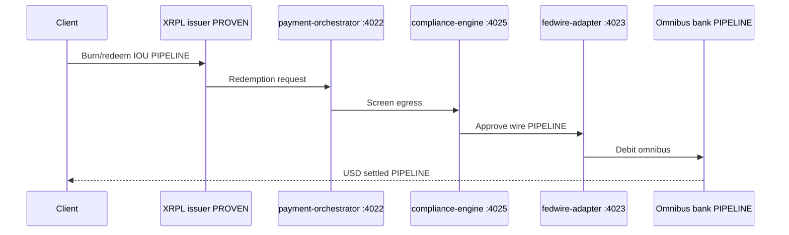
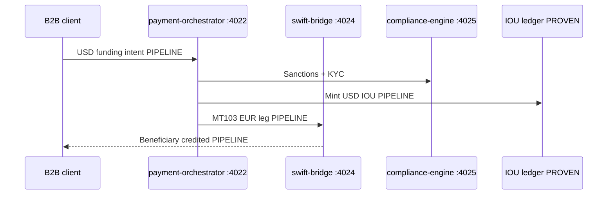
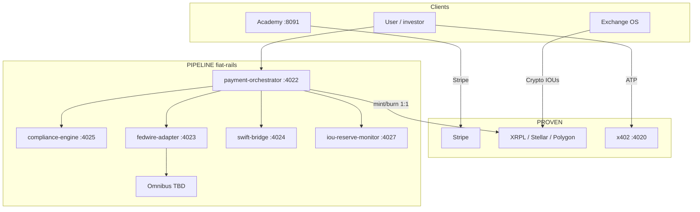

# TROPTIONS system manifest — post-MSB hybrid fiat-crypto blueprint

**Last updated:** 2026-05-21  
**Overall status:** **DESIGN** / **PIPELINE** until FinCEN MSB program and correspondent omnibus are live and verified.  
**Labels:** **PROVEN** (repo + live HTTP/explorer), **PIPELINE** (designed, stub, awaiting credentials), **PROJECTION** (scenario math — not forecasts or audited financials).

**Related:** [TROPTIONS revenue engine](TROPTIONS_REVENUE_ENGINE.html) · [MSB fiat rails](MSB_FIAT_RAILS.html) · [Partner bank mesh](PARTNER_BANK_MESH.html) · [On-chain proof](ON_CHAIN_PROOF.html) · [XRPL & Stellar](XRPL_STELLAR_VERIFICATION.html) · [Architecture](ARCHITECTURE.html)

**PDF export (optional):** `scripts/generate-manifest-pdf.ps1` — requires `pandoc` (and optionally `wkhtmltopdf`); HTML fallback always written to `docs/downloads/SYSTEM_MANIFEST.html`.

---

## Honesty banner (read first)

| Claim | Allowed today | Label |
|-------|---------------|-------|
| ~874M IOUs on XRPL + Stellar | Issued supply / **proven demand** | **PROVEN** (ledger) |
| ~874M = bank reserves or AUM | **Do not claim** | Misleading |
| Fully-backed 1:1 USD redemption | **Not operational** | **PIPELINE** |
| Fiat rails (FedWire / SWIFT / MSB) | Stubs in `fiat-rails/` | **DESIGN** / **PIPELINE** |
| Neobank / BaaS revenue tables | Product design only | **PROJECTION** |
| Funding **$2M–$3.5M** | Internal capitalization plan | **PROJECTION** |

**Shift when live:** unfunded promise-to-pay IOUs → **redeemable claims** backed by **audited** omnibus reporting (not marketing copy).

---

## Hybrid fiat-crypto model

1. **PROVEN today:** Crypto IOUs on XRPL/Stellar/Polygon; Academy Stripe; launcher; x402 health; L1 node.  
2. **PIPELINE:** USD/EUR enters via FedWire/ACH/SWIFT → `compliance-engine` screens → `payment-orchestrator` routes → omnibus credit → mint IOU 1:1 on ledger.  
3. **Redemption (PIPELINE):** Burn IOU → orchestrator → compliance → wire out.  
4. **PROJECTION:** Neobank app and BaaS APIs sit on the same orchestrator — no live interchange until card program ships.

Legacy Python stubs under `backend/payment-orchestrator` and `backend/msb-compliance` (:4098) are **superseded** by `fiat-rails/` (:4022–:4027). **No duplicate PM2 apps.**

---

## ASCII architecture (post-MSB target)

```
┌─────────────────────────────────────────────────────────────────────────┐
│ CLIENTS: Exchange OS │ Academy │ TTN │ Neobank (PROJECTION) │ x402    │
└────────────┬───────────────────────┬──────────────────┬───────────────┘
             │ fiat intent           │ Stripe (PROVEN)  │ ATP :4020
             v                       v                  v
┌──────────────────────┐    ┌──────────────┐    ┌──────────────┐
│ payment-orchestrator │    │ fth :8091    │    │ popeye :4021 │
│        :4022         │    │ ttn  :8092   │    └──────────────┘
└──────┬───────┬───────┘    └──────────────┘
       │       │
       │       ├──► compliance-engine :4025 (KYC/OFAC/SAR)
       │       ├──► fedwire-adapter  :4023
       │       └──► swift-bridge     :4024
       │
       v
┌──────────────────┐     mint/burn 1:1      ┌─────────────────────────┐
│ Bank omnibus     │ ◄──────────────────────►│ XRPL/Stellar issuer     │
│ (PIPELINE)       │                           │ ~874M IOU PROVEN demand │
└──────────────────┘                           └─────────────────────────┘
       ▲
       └── iou-reserve-monitor :4027 (ledger vs bank — NOT claiming backed today)
```

**Port discipline:** `popeye-relay` **:4021**; fiat rails **:4022–:4028**; BaaS API **:8097** — no collision with core backends 8090–8093.

---

## Fiat-rails service integration table

| Service | Port | Path | Upstream / downstream | Label |
|---------|------|------|------------------------|-------|
| `payment-orchestrator` | **4022** | `fiat-rails/orchestrator/` | Wire webhook → IOU; compliance + FedWire stubs | **PIPELINE** |
| `fedwire-adapter` | **4023** | `fiat-rails/fedwire-adapter/` | Orchestrator ↔ bank FedWire | **PIPELINE** |
| `swift-bridge` | **4024** | `fiat-rails/swift-bridge/` | Orchestrator ↔ MT103/202 bureau | **PIPELINE** |
| `compliance-engine` | **4025** | `fiat-rails/compliance-engine/` | All fiat ingress/egress screening | **PIPELINE** |
| `neobank-api` | **4026** | `fiat-rails/neobank-api/` | Mobile/card partner (design) | **PROJECTION** |
| `iou-reserve-monitor` | **4027** | `fiat-rails/iou-reserve-monitor/` | Omnibus statements vs ledger supply | **PIPELINE** |
| `arbitrage-bot` | **4028** | `fiat-rails/arbitrage-bot/` | x402 orderbook watch → orchestrator arb | **PIPELINE** |
| `baas-api` | **8097** | `fiat-rails/baas-api/` | BaaS x402 onboarding + PROJECTION dashboard | **PROJECTION** |

**Setup:** `.\scripts\setup-fiat-rails.ps1` · `.\scripts\setup-arbitrage-baas.ps1` · **PM2:** `pm2 start ecosystem.config.js --only payment-orchestrator,fedwire-adapter,swift-bridge,compliance-engine,neobank-api,iou-reserve-monitor,arbitrage-bot,baas-api`

**OpenAPI:** `fiat-rails/orchestrator/openapi.yaml`

---

## IOU issuer model (**PROVEN** supply, **PIPELINE** backing)

| Fact | Label | Investor language |
|------|-------|-------------------|
| **~874M** issued on XRPL + Stellar (TROPTIONS, USDC, USDT, EURC, DAI **codes**) | **PROVEN** | **Issued demand** — not bank reserves |
| Issuer `rJLMST…` / `GB4FHG…` | **PROVEN** | Gateway-issued IOUs |
| USDC/USDT on XRPL | **PROVEN** (IOU) | **Not** Circle/Tether **native** mainnet tokens |
| Regulated 1:1 fiat redemption today | **Not claimed** | Promise-to-pay until omnibus live |
| Operator desk ~$175M narrative | **PIPELINE** | Attestation only — not verified without bank statements |

---

## Sequence diagrams (target state — **PIPELINE**)

### 1. Fiat deposit → IOU mint



### 2. IOU redeem → fiat out



### 3. Cross-border USD → IOU → EUR (SWIFT)



---

## Implementation phases 1–5

| Phase | Scope | Exit criteria | Label |
|-------|--------|---------------|-------|
| **1** | MSB artifact vault; `fiat-rails` stubs; IOU copy fix on investor surfaces | Six `/health` return `pipeline`; PM2 ports 4022–4027 | **PIPELINE** |
| **2** | Orchestrator contracts; Exchange OS fiat behind feature flag | `POST /payments/request` wired to compliance mock | **PIPELINE** |
| **3** | FedWire sandbox + SWIFT skeleton with bank partner | First sandbox wire trace (non-prod) | **PIPELINE** |
| **4** | Omnibus live; `iou-reserve-monitor` daily reconcile | Attestation memo separate from on-chain supply | **PIPELINE** → **PROVEN** |
| **5** | Neobank/BaaS pilots | GL + legal sign-off before marketing interchange | **PROJECTION** |

---

## Revenue streams A–E

| Stream | Description | Label |
|--------|-------------|-------|
| **A** | Issuance/redemption fees (0.1–0.25% illustrative) | **PIPELINE** |
| **B** | Float margin (omnibus yield − holder yield) | **PIPELINE** |
| **C** | Exchange/desk spread | **PIPELINE** (desk attestation gated) |
| **D** | Cross-border B2B (USD→IOU→EUR) | **PIPELINE** |
| **E** | WC26 / TTN sponsor settlement | **PIPELINE** |

**PROVEN cash today:** Academy, launcher, x402 — **not** MSB wire volume or neobank interchange.

## 6. TROPTIONS revenue engine (canonical map)

Full activation waves (IMMEDIATE / HOURS / MSB go-live), **18** labeled streams (A–F + live core), daily **PROJECTION** snapshot, flywheel diagram, and operator activation steps (batch pools, `DRY_RUN` arbitrage, x402 gateway, wire endpoint):

→ **[`TROPTIONS_REVENUE_ENGINE.md`](TROPTIONS_REVENUE_ENGINE.html)** — honest **PROVEN** / **PIPELINE** / **PROJECTION** labels; references commits `fac96df` (wire → IOU), `ebc3aef` (fiat-rails scaffold).

### Economic scenarios (**PROJECTION** only)

| Scenario | Illustrative monthly | Annualized | Label |
|----------|---------------------|------------|-------|
| Conservative rails throughput | ~$305K/mo | ~$3.6M/yr | **PROJECTION** |
| Scale rails throughput | ~$2.6M/mo | ~$31M/yr | **PROJECTION** |
| $50M/mo IOU flow (A–E bundle) | ~$578K/mo | — | **PROJECTION** |
| $500M/mo IOU flow | ~$4.9M/mo | — | **PROJECTION** |

---

## Funding ask (**PROJECTION**)

| Item | Range | Label | Use (planning) |
|------|-------|-------|----------------|
| MSB + bank + compliance + engineering + reserve seed | **$2M – $3.5M** | **PROJECTION** | Omnibus, legal, integration — **not** an offering term sheet |

*(Prior $5–10M range superseded for investor pack alignment; adjust only with counsel.)*

---

## Neobank & BaaS (**PROJECTION**)

| Neobank line (illustrative) | 10K users | 100K users | Label |
|----------------------------|-----------|------------|-------|
| Interchange ~1.5% | $75K/mo | $750K/mo | **PROJECTION** |
| Premium subs | $10K/mo | $100K/mo | **PROJECTION** |
| Float margin | $80K/mo | $400K/mo | **PROJECTION** |
| **Subtotal** | **~$170K/mo** | **~$1.3M/mo** | **PROJECTION** |

| BaaS | Illustrative $/mo | Label |
|------|-------------------|-------|
| 5 × ~$10K platform | $50K | **PROJECTION** |
| 50 × ~$10K | $500K | **PROJECTION** |

---

## PM2 service map

Source of truth: `ecosystem.config.js`. Regenerate: `npm run docs:update`.

<!-- AUTO:PM2_PORTS_START -->
| PM2 name | Port | Label | Path | Notes |
|----------|------|-------|------|-------|
| `troptions-l1-node` | **9944** (RPC), **9945** (`/metrics`) | **PROVEN** | `l1/` | Rust L1; local/operator host |
| `donk-ai-tutor` | **8090** | **PROVEN** | `ai/donk-tutor/` | RAG + Ollama |
| `fth-backend` | **8091** | **PROVEN** | `backend/fth-academy/` | Academy API + Stripe patterns |
| `ttn-launcher` | **8092** | **PROVEN** | `backend/ttn-launcher/` | TTN / sports backend |
| `dao-service` | **8093** | **PROVEN** | `backend/dao-service/` | Governance API |
| `x402-gateway` | **4020** | **PROVEN** | `backend/x402-gateway/` | Metered ATP sidecar |
| `popeye-relay` | **4021** | **PROVEN** | `backend/popeye-relay/` | Stale agent relay |
| `payment-orchestrator` | **4022** | **PIPELINE** | `fiat-rails/orchestrator/` | Wire → IOU (`POST /api/v1/payments/wire`) |
| `fedwire-adapter` | **4023** | **PIPELINE** | `fiat-rails/fedwire-adapter/` | FedWire RTGS adapter stub |
| `swift-bridge` | **4024** | **PIPELINE** | `fiat-rails/swift-bridge/` | MT103/202 messaging stub |
| `compliance-engine` | **4025** | **PIPELINE** | `fiat-rails/compliance-engine/` | AML/KYC/OFAC stub |
| `neobank-api` | **4026** | **PROJECTION** | `fiat-rails/neobank-api/` | Neobank API design stub |
| `iou-reserve-monitor` | **4027** | **PIPELINE** | `fiat-rails/iou-reserve-monitor/` | Omnibus vs ledger reconciliation stub |
<!-- AUTO:PM2_PORTS_END -->

---

<!-- AUTO:IOU_REVENUE_START -->
## 5. MSB / SWIFT / FedWire & IOU Revenue Model

*Placeholder — run `npm run docs:update` to sync from `docs/TROPTIONS_IOU_ISSUER_MANIFEST.md`.*
<!-- AUTO:IOU_REVENUE_END -->

---

## Banking rails status

| Rail | Label | Monorepo hook |
|------|-------|---------------|
| MSB (FinCEN program) | **PIPELINE** | Operator vault + `compliance-engine` |
| FedWire RTGS | **PIPELINE** | `fedwire-adapter` :4023 |
| SWIFT MT103/202 | **PIPELINE** | `swift-bridge` :4024 |
| ACH (correspondent) | **PIPELINE** | Via bank partner |
| Stripe (Academy) | **PROVEN** | `fth-backend` :8091 |
| x402 / Apostle | **PROVEN** (health) | :4020 / :7332 when up |

---

## Fiat ↔ crypto flow (overview)



---

## Next actions (operator)

1. Run `.\scripts\setup-fiat-rails.ps1` and start six fiat PM2 apps; verify `/health` on 4022–4027.  
2. Store MSB/bank/API keys in operator vault — copy `fiat-rails/.env.template` → `.env` locally (**never commit**).  
3. Legal review of BSA/AML pack before any live wire.  
4. Re-run `npm run docs:update` and `.\scripts\generate-manifest-pdf.ps1` before investor meetings.  
5. Fix Exchange OS / investor copy: IOU ≠ Circle native USDC; ~874M ≠ reserves.

---

## API surface (**PIPELINE**)

```
POST /api/v1/payments/wire      # orchestrator :4022 — wire webhook → IOU mint
GET  /api/v1/payments/:id       # orchestrator :4022 — payment status
POST /screen                    # compliance-engine :4025 — dev approve (strict mode optional)
POST /verify                    # fedwire-adapter :4023 — wire verify stub
POST /api/compliance/screen     # compliance-engine :4025 (alias)
POST /api/compliance/kyc        # compliance-engine
POST /api/fedwire/send          # fedwire-adapter :4023
POST /api/swift/send            # swift-bridge :4024
GET  /api/swift/status/:id      # swift-bridge
GET  /api/reserve/attestation   # iou-reserve-monitor :4027
GET  /api/neobank/balance       # neobank-api :4026 (PROJECTION)
POST /api/v1/arbitrage          # orchestrator :4022 — arb execute/dry-run
POST /api/v1/tokens             # baas-api :8097 — x402 $10K setup stub
POST /api/v1/pools              # baas-api :8097 — single pool (402)
POST /api/v1/pools/batch        # baas-api :8097 — batch pools (402 sum)
GET  /api/v1/pools/jobs         # baas-api :8097 — job queue
GET  /api/v1/dashboard/:id/revenue  # baas-api — PROJECTION revenue
GET  /x402/market-data/orderbook    # x402-gateway :4020
```

See [ARBITRAGE_AND_BAAS](ARBITRAGE_AND_BAAS.html) · [LOCAL_PREVIEW](LOCAL_PREVIEW.html).

---

## Document index

| Doc | Purpose |
|-----|---------|
| [SYSTEM_MANIFEST](SYSTEM_MANIFEST.html) | This file |
| [TROPTIONS_REVENUE_ENGINE](TROPTIONS_REVENUE_ENGINE.html) | Waves, 18 streams, flywheel, activation |
| [MSB_FIAT_RAILS](MSB_FIAT_RAILS.html) | Capitalization tree |
| [ON_CHAIN_PROOF](ON_CHAIN_PROOF.html) | Explorer tables |
| [`fiat-rails/README`](../../fiat-rails/README.md) | Stub ops |
| [`TROPTIONS_IOU_ISSUER_MANIFEST.md`](../TROPTIONS_IOU_ISSUER_MANIFEST.md) | IOU issuer v3.0 (section 5 source) |
| [PARTNER_BANK_MESH](PARTNER_BANK_MESH.html) | Multi-bank mesh + Alexandrite (**PROJECTION**) |
| [`fiat-rails/orchestrator/README`](../../fiat-rails/orchestrator/README.md) | Wire → IOU ops |
| [ARBITRAGE_AND_BAAS](ARBITRAGE_AND_BAAS.html) | Arbitrage bot + BaaS x402 |
| [BAAS_BATCH_POOLS](BAAS_BATCH_POOLS.html) | Batch pool call sequence (:8097) |
| [`fiat-rails/baas-api/README`](../../fiat-rails/baas-api/README.md) | BaaS liquidity API |
| [LOCAL_PREVIEW](LOCAL_PREVIEW.html) | Port 3123 preview fix |

*PM2 rows sync from `ecosystem.config.js`. Prose labels edited here.*
