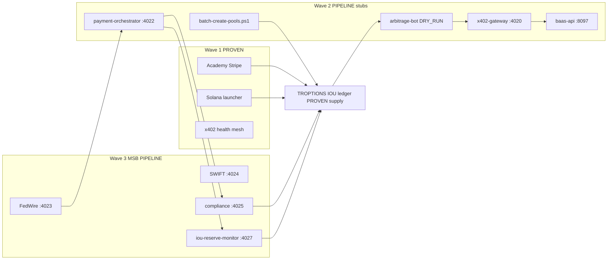

# TROPTIONS revenue engine — monetary core, activation waves, honest labels

**Last updated:** 2026-05-21  
**Audience:** Investors, operators, technical diligence.  
**Labels:** **PROVEN** (ledger, live product, repo + HTTP), **PIPELINE** (built stubs — not live settlement), **PROJECTION** (scenario math — **not** audited forecasts).

**Related:** [System manifest](SYSTEM_MANIFEST.html) · [MSB fiat rails](MSB_FIAT_RAILS.html) · [IOU issuer manifest v3.0](../TROPTIONS_IOU_ISSUER_MANIFEST.md) · [Arbitrage & BaaS](ARBITRAGE_AND_BAAS.html) · [Partner bank mesh](PARTNER_BANK_MESH.html)

**Code anchors:** Wire → IOU path landed in commit `fac96df`; post-MSB fiat-rails scaffolding in `ebc3aef`. Batch pools: [`scripts/batch-create-pools.ps1`](../../scripts/batch-create-pools.ps1) · [`ARBITRAGE_BAAS_X402_COMPLETE.md`](../../ARBITRAGE_BAAS_X402_COMPLETE.md).

---

## Honesty banner (read first)

| Claim | Allowed today | Label |
|-------|---------------|-------|
| ~874M IOUs on XRPL + Stellar | Issued supply / proven demand | **PROVEN** (ledger) |
| IOUs = Circle USDC or bank reserves | **Do not claim** | Misleading |
| 1:1 fiat-backed redemption | Omnibus + MSB **PIPELINE** | **PIPELINE** |
| “Revenue in wallet within seconds” | **Only** for local x402/BaaS **mock verify** or stub ledger credits — **not** omnibus cash until pools + exchange + MSB live | **PIPELINE** / dev stub |
| Academy + Solana launcher cash | Stripe / launch fees on live surfaces | **PROVEN** |
| All 16+ streams active today | **No** — see table per stream | Mixed |

---

## TROPTIONS as monetary core

TROPTIONS is the **settlement and issuance layer** for the stack — not Circle native USDC on XRPL/Stellar.

| Layer | What it is | Label |
|-------|------------|-------|
| **Issued IOUs** | TROPTIONS, USDC/USDT/DAI/EURC **codes** on issuer accounts | **PROVEN** supply (~874M cross-chain issued — **demand proof**, not AUM) |
| **Backing model** | Target **1:1 reserve** at partner omnibus when MSB + FedWire/SWIFT live | **PIPELINE** (1:1 mint/burn in orchestrator design) |
| **Today** | Promise-to-pay credits; redemption rail not operational | **PROVEN** IOU · **PIPELINE** redemption |
| **Monetary rail** | `payment-orchestrator` :4022 wire webhook → compliance → mint | **PIPELINE** (code **PROVEN** in repo since `fac96df`) |

**Investor one-liner:** Proven **~874M IOU demand** on ledger → **PIPELINE** converts to redeemable claims when MSB + bank omnibus are live — fees A–F and agent rails layer on top.

---

## Speed to money — three activation waves

| Wave | Time-to-cash | What turns on | Label |
|------|----------------|---------------|-------|
| **Wave 1 — IMMEDIATE** | Minutes–hours (existing products) | FTH Academy Stripe, Solana launcher, public x402 health, SNP/Genesis surfaces, Polygon community tokens | **PROVEN** (product live; volume varies) |
| **Wave 2 — HOURS** | Same day after operator starts PM2 + scripts | `batch-create-pools.ps1`, arbitrage bot with **`DRY_RUN=true`**, BaaS/x402 **mock** pay receipts, wire stub `POST /api/v1/payments/wire` → mock IOU hash | **PIPELINE** (infrastructure + stub credits — **not** bank cash) |
| **Wave 3 — MSB go-live** | Days–weeks (bank + compliance) | FedWire/SWIFT credentials, omnibus, `iou-reserve-monitor` attestation, live pool trading, interchange | **PIPELINE** → **PROVEN** per stream when attested |

**Correction:** Marketing “revenue in wallet within seconds” applies **only** to Wave 2 **stub/mock** paths (x402 invoice verify in dev, BaaS dashboard counters, orchestrator mock issuance) until **exchange liquidity + MSB omnibus** settle real fiat. Wave 1 Academy/launcher remain the only **PROVEN** cash today.

---

## Revenue streams — 18 rows (categories A–F + live core)

| # | Category | Stream | Speed wave | Label today | Notes |
|---|----------|--------|------------|-------------|-------|
| 1 | **A** | Issuance fee (0.1–0.25% on wire-in) | 3 | **PIPELINE** | `POST /api/v1/payments/wire` — `fac96df` |
| 2 | **A** | Redemption fee (wire-out after burn) | 3 | **PIPELINE** | Orchestrator + FedWire stub |
| 3 | **B** | Float margin (omnibus yield − holder yield) | 3 | **PIPELINE** | Requires live omnibus |
| 4 | **C** | Exchange trading fee (~0.25%) | 2–3 | **PIPELINE** | Pools via `batch-create-pools.ps1`; desk gated |
| 5 | **C** | Desk / round-trip spread (~0.1%) | 3 | **PIPELINE** | Operator attestation — not verified $175M without rails |
| 6 | **D** | Cross-border B2B (USD→IOU→EUR) | 3 | **PIPELINE** | `swift-bridge` :4024 — `ebc3aef` scaffold |
| 7 | **E** | WC26 / TTN sponsorship tiers | 1–2 | **PIPELINE** | Live sports surface; tiers not booked revenue |
| 8 | **E** | TTN commerce discount take (~1.5%) | 3 | **PIPELINE** | Settlement when sponsor volume flows |
| 9 | **F** | Neobank interchange (~1.5%) | 3 | **PROJECTION** | `neobank-api` :4026 design stub |
| 10 | **F** | Neobank premium subs | 3 | **PROJECTION** | Card program not shipped |
| 11 | **F** | BaaS platform fee (~$10K/client illustrative) | 2–3 | **PROJECTION** | `baas-api` :8097 — x402-gated onboarding |
| 12 | **F** | BaaS pool / txn fee (0.25%) | 2–3 | **PIPELINE** | Pool create via BaaS + batch script |
| 13 | **F** | Arbitrage cross-pair profit | 2 | **PIPELINE** | `arbitrage-bot` :4028 — **`DRY_RUN=true` default** |
| 14 | **F** | x402 API microfees (orderbook, orders, cards) | 2 | **PIPELINE** | Monorepo `:4020` + proxied routes; public mesh separate |
| 15 | **F** | x402 BaaS onboard gate ($10K illustrative) | 2 | **PIPELINE** | Invoice + mock verify until production merge |
| 16 | **F** | Alexandrite / AXL001 collateral playbook | 3 | **PROJECTION** | See [Partner bank mesh](PARTNER_BANK_MESH.html) |
| 17 | **Live** | FTH Academy subscriptions | 1 | **PROVEN** | `$19` / `$49` / `$149` — `fth-backend` :8091 |
| 18 | **Live** | Solana launcher launch fees | 1 | **PROVEN** | launch.unykorn.org |

**Also live (not in A–F fee bundle):** SNP namespace governance, Genesis/GSP coordination, Polygon KENNY/EVL community, TANTHEM NFT mint (client-side; ledger mint **PENDING**), DAO API — treat incremental cash as **PROVEN** only where Stripe/launch/metering is booked.

---

## Daily snapshot — **PROJECTION / illustrative only**

**Not an audited forecast.** Assumes Wave 3 rails live + Wave 2 pools started + illustrative volumes from [`ARBITRAGE_BAAS_X402_COMPLETE.md`](../../ARBITRAGE_BAAS_X402_COMPLETE.md) monthly map ÷ 30.

| Line (illustrative day) | USD/day | Label |
|-------------------------|---------|-------|
| Issuance/redemption (IOU core) | ~$8,300 | **PROJECTION** |
| Float income | ~$5,600 | **PROJECTION** |
| Exchange + spread | ~$4,200 | **PROJECTION** |
| Arbitrage | ~$500 | **PROJECTION** |
| Neobank bundle | ~$8,300 | **PROJECTION** |
| BaaS + x402 microfees | ~$4,700 | **PROJECTION** |
| **Illustrative rails subtotal** | **~$31,600/day** | **PROJECTION** |
| Academy + launcher (today-scale placeholder) | ~$200–$2,000 | **PROVEN** category — **actual books not published here** |

---

## TROPTIONS flywheel

**One-liner:** Fiat intent → compliance → **TROPTIONS IOU** mint → liquidity pools → trading + arbitrage → fees recycle through x402-metered APIs and BaaS dashboards → reserve monitor attests 1:1 when MSB live.

---

## Activation steps (operator)

| Step | Action | Wave | Label |
|------|--------|------|-------|
| 1 | `pm2 start ecosystem.config.js` — verify `:8091` Academy, `:4020` x402, fiat `:4022–4028`, `baas-api` `:8097` | 1–2 | **PROVEN** / **PIPELINE** per app |
| 2 | Copy `fiat-rails/.env.template` → `.env` locally (**never commit**); optional `ISSUER_SEED` for test mint | 2 | **PIPELINE** |
| 3 | **Batch pools:** `.\scripts\batch-create-pools.ps1 -BaaSUrl "http://localhost:8097" -ApiKey "<key>" -WalletAddress "r…"` | 2 | **PIPELINE** until exchange live |
| 4 | **Arbitrage:** `DRY_RUN=true` in `fiat-rails/arbitrage-bot/.env`; `POST http://localhost:4028/start` | 2 | **PIPELINE** — no live settlement |
| 5 | **x402 gateway:** start `:4020`; exercise proxied routes per [X402 integration](X402_INTEGRATION.html) | 2 | **PIPELINE** mock pay |
| 6 | **Wire endpoint:** `POST http://127.0.0.1:4022/api/v1/payments/wire` with test body (see `fiat-rails/README.md`) | 2 | **PIPELINE** — `fac96df` path |
| 7 | MSB + bank credentials → enable FedWire/SWIFT live; daily `iou-reserve-monitor` | 3 | **PIPELINE** → **PROVEN** when attested |

**Regenerate docs after ecosystem changes:** `npm run docs:update` from repo root.

---

## Scenario totals (**PROJECTION** — monthly, not audited)

Aligned with layered map in [`ARBITRAGE_BAAS_X402_COMPLETE.md`](../../ARBITRAGE_BAAS_X402_COMPLETE.md) when **all** components are active (hypothetical steady state):

| Layer | Illustrative monthly | Label |
|-------|---------------------|-------|
| IOU core (issuance + float) | ~$417K | **PROJECTION** |
| Exchange + spread | ~$125K | **PROJECTION** |
| Arbitrage | ~$15K | **PROJECTION** |
| Neobank | ~$85K | **PROJECTION** |
| BaaS | ~$125K | **PROJECTION** |
| x402 | ~$17K | **PROJECTION** |
| **Illustrative total** | **~$784K/mo** | **PROJECTION** |

**Today:** Book **PROVEN** cash from Wave 1 only; treat table above as engineering target math after Wave 3 — not current P&amp;L.

---

## Document index

| Doc | Purpose |
|-----|---------|
| [TROPTIONS_REVENUE_ENGINE](TROPTIONS_REVENUE_ENGINE.html) | This file — waves, 18 streams, flywheel |
| [SYSTEM_MANIFEST](SYSTEM_MANIFEST.html) | Ports, rails, section 5 IOU sync |
| [ARBITRAGE_AND_BAAS](ARBITRAGE_AND_BAAS.html) | Bot + BaaS API detail |
| [`fiat-rails/orchestrator/README`](../../fiat-rails/orchestrator/README.md) | Wire → IOU ops |
| [`scripts/batch-create-pools.ps1`](../../scripts/batch-create-pools.ps1) | Alexandrite / GOLD / partner pools |

*Regenerate HTML: `npm run docs:update`.*
