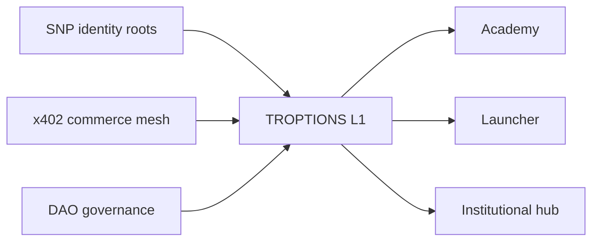

# Valuation & comparables — TROPTIONS / FTH / Unykorn

**Last updated:** 2026-05-21  
**Maturity (honest):** **9.8 / 10** — DAO + cross-chain proof on main; **gap to 10:** public TLS on `troptions.org` hostnames + XRPL production reserve top-up.  
**Labels:** **PROVEN** (repo + explorer + live HTTP), **PIPELINE** (designed, not booked), **PROJECTION** (illustrative scenarios — not forecasts).

---

## Executive framing

This document separates **what is cash-real today**, **what it would cost to rebuild**, **what is in flight**, and **illustrative upside** if pipeline segments close. It does **not** claim market capitalization from issued IOU supply (~874M on ledger is **not** equity value).

**Trifecta narrative (in this integration monorepo):** post-quantum **identity** (SNP) + agent **commerce** (x402) + on-chain **governance** (DAO ↔ L1). That combination is unusually complete **here** — not a claim that no other vendor offers pieces of each pillar globally.

---

## Current cash value (PROVEN + PIPELINE)

| Revenue stream | Label | Model | Notes |
|----------------|-------|-------|-------|
| FTH Academy | **PROVEN** | $19 / $49 / $149 subscriptions | Live at [fthedu.unykorn.org](https://fthedu.unykorn.org) |
| Solana launcher SaaS | **PROVEN** | Per-launch & mint fees | [launch.unykorn.org](https://launch.unykorn.org) |
| x402 agent commerce | **PROVEN** | Metered API · ATP on Apostle (7332) | **Health LIVE:** [x402.unykorn.org/health](https://x402.unykorn.org/health). **Twin demo PENDING:** [twin.unykorn.org](https://twin.unykorn.org) (522/timeouts) |
| SNP namespaces | **PROVEN** (spec + roots) | Scarcity / governance fees | **955** constitutional roots per SNP docs (not 1,000) |
| Genesis / GSP | **PROVEN** | Treasury rails · coordination | [drunks.app](https://drunks.app) · 9 Polygon contracts |
| Cross-chain issuance utility | **PROVEN** | Trust lines · issuance services | ~874M **issued** on ledger — utility, not booked ARR |
| DAO governance API | **PROVEN** | Platform / council tooling | `dao-service` + dashboard; public `dao.troptions.org` DNS **PIPELINE** |
| TTN / WC26 sports | **PIPELINE** | $500 / $2.5K / $10K sponsorship tiers | Not booked revenue until sponsors sign |
| Exchange / desk | **GATED** | Spread / IOU desk fees | Do **not** cite $175M desk as on-chain fact |
| RWA / T-Lev-8 | **PIPELINE** | LEV8 licensing gates | [T-Lev-8 Pages](https://fthtrading.github.io/T-Lev-8-/) |
| Polygon community (KENNY / EVL) | **PROVEN** | Community token economics | PolygonScan-verified addresses |

**Cash today (honest):** early-scale **PROVEN** lines = Academy + launcher + x402 metered fees at operator-reported early volume. **PIPELINE** and **PROJECTION** rows are **not** in audited books.

---

## Replacement cost (build-from-zero today)

| Band | Scope | Estimate | Label |
|------|-------|----------|-------|
| Conservative | Monorepo L1 + backends + investor surfaces + SNP integration + partial satellites | **$2.6M – $4.8M** · 18–24 months | Engineering replacement — not liquidation value |
| With DAO + governance hardening | Above + DAO service, signed RPC, council multisig, dashboard | **$3.5M – $6.5M** · 20–28 months | Includes governance plane called out in audit |
| Ongoing ops (ranges) | Cloudflare + AWS x402 + PM2 operator host | ~$170–1,300 / mo | **PROVEN** cost bands, not audited GL |

**Sunk cost (PROVEN):** ~6,937 audit-scope source files, 17 Rust workspace crates (L1 + x402 financial core), 8/8 PM2 services — years of multi-repo engineering already deployed.

---

## Seven gaps (prioritized)

| # | Gap | Label | Impact |
|---|-----|-------|--------|
| 1 | Cloudflare origin health — `twin.unykorn.org`, `x402api.unykorn.org` | **PROVEN** flaky | Investor demos / agent twin UX |
| 2 | Public TLS on `troptions.org` (`ai`, `ttn`, `dao`) | **PIPELINE** | Brand DNS vs unykorn.org-only story |
| 3 | L1 asset anchoring (anthem soulbound / IPFS manifest on L1) | **PIPELINE** | Prepared manifests; node restart + anchor |
| 4 | x402 production path alignment (monorepo sidecar ↔ UnyKorn-AWS) | **PROVEN** health / **PENDING** twin | Do not conflate `:4020` sidecar with public mesh |
| 5 | IPFS publication for SNP + anthem CIDs in investor proof path | **PIPELINE** | Pinata CIDs exist; SNP cross-link in proof pack |
| 6 | XRPL production XRP reserves (issuer / AMM thin) | **PROVEN** thin | Operational but needs top-up |
| 7 | T-Build Vitest suite green after `npm ci` | **PROVEN** blocked | Partner launch OS demos |

**Score impact:** Fixing **#1 + #2 + #6** moves narrative from **9.8 → 10/10** on engineering maturity (investor site copy).

---

## 30-day rocket fuel (weeks)

| Week | Focus | Outcomes |
|------|-------|----------|
| **1** | Edge reliability | Stabilize Cloudflare origins; document probe scripts; TLS templates → production certs on chosen hostnames |
| **2** | Commerce + treasury | x402 twin green; reconcile UnyKorn-AWS vs monorepo sidecar docs; XRPL reserve top-up + published reserve policy |
| **3** | Identity + proof | SNP ↔ IPFS cross-links in counterparty pack; L1 anchor anthem credential; refresh `ON_CHAIN_PROOF` |
| **4** | Partner readiness | T-Build tests green; label **booked vs PIPELINE** revenue in CRM; sponsor + issuer outreach |

---

## 12–24 month valuation scenarios (PROJECTION — illustrative only)

| Scenario | Assumptions (all PROJECTION) | Illustrative enterprise value band |
|----------|------------------------------|-------------------------------------|
| **Base** | Academy + launcher scale; x402 modest agent volume; no large desk deals | Replacement cost floor → **$3M – $5M** strategic acqui-hire / license |
| **Growth** | 2–3 issuer programs + WC26 sponsor tier closes + SNP integrator fees | **$8M – $15M** — still not public-market cap |
| **Strategic** | RWA gates live + x402 standard adoption in agent mesh + DAO treasury flywheel | **$20M – $40M** — requires **PROJECTION** revenue proof, not ledger IOU supply |

**Disclaimer:** These bands are **illustrative PROJECTIONS** for strategic conversations. They are **not** audited financials, registered securities offerings, or guarantees. Token **issued supply ≠ market cap**.

---

## Competitive landscape (honest differentiation)

### Pillar A — SNP vs ENS / Unstoppable / Handshake

| Dimension | ENS | Unstoppable | Handshake | **SNP (Unykorn)** |
|-----------|-----|-------------|-----------|-------------------|
| Trust model | Ethereum L1 registry | Custodial/Web2 hybrid | Handshake auction chain | **Post-quantum roots (Dilithium5), stateless verify** |
| Supply | Millions of .eth | Branded domains | HNS coins | **955** constitutional roots (fixed scarcity narrative) |
| Chain scope | EVM-primary | Multi-chain marketing | HNS only | **Constitutional layer** for L1 + partner OS in **this monorepo** |
| Maturity | Production | Production | Niche | **PROVEN** spec + integration paths; not mass retail DNS |

**Honest take:** ENS wins EVM ecosystem distribution. SNP wins **PQ-ready namespace constitution** tied to TROPTIONS L1 and FTH partner OS — different buyer.

### Pillar B — x402 vs Coinbase / BNB / Rootstock

| Dimension | Coinbase x402 (ecosystem) | BNB pay rails | Rootstock | **Unykorn x402** |
|-----------|---------------------------|---------------|-----------|------------------|
| Settlement | CEX-linked / partner stack | BSC-native | Bitcoin L2 | **Apostle Chain ATP (7332)** + HTTP 402 |
| Status | Major brand pilots | Exchange-native | BTC DeFi | **PROVEN** [health](https://x402.unykorn.org/health); **twin PENDING** |
| Agent model | Emerging | Wallet-centric | Contract-centric | **Metered AI-to-AI** (not API keys) |
| Repo | Closed / partner | Binance stack | RSK docs | [UnyKorn-X402-aws](https://github.com/FTHTrading/UnyKorn-X402-aws) public |

**Honest take:** Coinbase wins distribution and compliance brand. Unykorn wins **sovereign agent meter + ATP** integrated with FTH stack — niche, real, not “beats Coinbase globally.”

### Pillar C — Unykorn L1 vs ICP / Fleek

| Dimension | ICP | Fleek | **TROPTIONS L1 (monorepo)** |
|-----------|-----|-------|------------------------------|
| Architecture | Internet Computer subnets | Web3 hosting / IPFS edge | **Rust sovereign sequencer, RocksDB, SNP hooks** |
| Maturity | Production network | Production hosting | **PROVEN** code + local PM2; single-node (not BFT fleet) |
| Differentiation | Chain-as-cloud | Deploy UX | **Treasury multisig + DAO reads + issuance utility** |

**Honest take:** ICP/Fleek win hosted scale. L1 wins **integrated treasury + governance + namespace migration** for TROPTIONS operator — not general-purpose cloud replacement.

### Pillar D — DAO vs Aragon / Snapshot / Tally / DAOstack

| Dimension | Aragon | Snapshot | Tally | DAOstack | **FTH DAO (monorepo)** |
|-----------|--------|----------|-------|----------|------------------------|
| Voting | On-chain orgs | Off-chain sigs | Governor analytics | Archetypes | **Council + L1-signed RPC** |
| Treasury | Vault plugins | External | Multi-chain UI | Stacks | **L1 treasury reads, multisig debits** |
| Maturity | Production | Production | Production | Legacy | **PROVEN** service; public DNS **PIPELINE** |
| Integration | Generic | Generic | Generic | Generic | **Native to TROPTIONS L1 + SNP claims** |

**Honest take:** Aragon/Snapshot win ecosystem. FTH DAO wins **tight coupling to L1 issuance and operator council** in **this repo** — contributes to **9.8/10** score.

---

## Full stack triad (identity · commerce · governance)

| Leg | What we ship | Honest limit |
|-----|--------------|--------------|
| **Identity** | SNP 955 roots, Dilithium5, namespace migration scripts | Not a retail ENS replacement |
| **Commerce** | x402 health LIVE, ATP settlement, Academy/launcher revenue | Twin origin still PENDING |
| **Governance** | DAO API, dashboard, multisig treasury rules | Single-node sequencer; BFT later |

**Qualifier:** This is the most complete **integrated** sovereign stack **in Troptions-full-pack and its named satellites** — not a claim that no other project combines all three elsewhere.

---

## FTHTrading projects / repos

| Repo | Role | Status |
|------|------|--------|
| [Troptions-full-pack](https://github.com/FTHTrading/Troptions-full-pack) | Monorepo: L1, backends, investor site | **Pages LIVE** |
| [sovereign-namespace-protocol](https://github.com/FTHTrading/sovereign-namespace-protocol) | SNP constitutional layer (955 roots) | **Public spec** |
| [UnyKorn-X402-aws](https://github.com/FTHTrading/UnyKorn-X402-aws) | Production x402 mesh | **Health LIVE; twin PENDING** |
| [Troptions](https://github.com/FTHTrading/Troptions) | Private Exchange OS source | **Vercel LIVE** |
| [TExchange](https://github.com/FTHTrading/TExchange) | Exchange variant lineage | **Public** |
| [solana-launcher](https://github.com/FTHTrading/solana-launcher) | Launch SaaS | **LIVE** |
| [genesis-world](https://github.com/FTHTrading/genesis-world) | GSP parallel stack | **drunks.app LIVE** |
| [T-Lev-8-](https://github.com/FTHTrading/T-Lev-8-) | RWA deal room | **Pages LIVE** |
| [T-Build](https://github.com/FTHTrading/T-Build) | TPLOS partner launch OS | **Local; tests gap** |
| [aurora-site](https://github.com/FTHTrading/aurora-site) | Aurora RWA portal | **Pages LIVE; custom DNS ERR** |
| [impact-site](https://github.com/FTHTrading/impact-site) | Impact / ESG | **DNS/Pages fix needed** |

Full map: [`ECOSYSTEM_MAP.md`](ECOSYSTEM_MAP.html).

---

## Related diligence

| Doc | Purpose |
|-----|---------|
| [`FINAL_ECOSYSTEM_AUDIT.md`](FINAL_ECOSYSTEM_AUDIT.html) | **9.8/10** scorecard |
| [`ON_CHAIN_PROOF.md`](ON_CHAIN_PROOF.html) | Explorer tables |
| [`counterparty/PROOF_FOR_COUNTERPARTIES.md`](counterparty/PROOF_FOR_COUNTERPARTIES.html) | Institutional pack |
| [Investor site — #valuation](https://fthtrading.github.io/Troptions-full-pack/#valuation) | Interactive comparables |

---

*Projections disclaimer:* Any “if X clients” revenue or valuation band in this file is **PROJECTION** for strategic planning only — not an offer, forecast, or audited financial statement.
