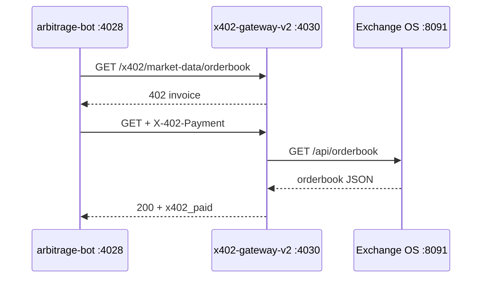
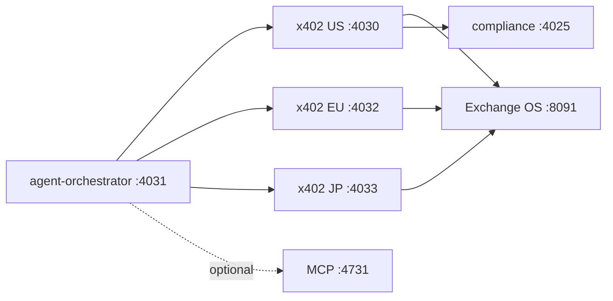

# x402 Global Mesh (TROPTIONS)

**Status:** PIPELINE (gateways respond; ATP settlement and fee counters are PROJECTION)  
**Date:** 2026-05-21

## What x402 is in this stack

HTTP **402 Payment Required** is the metered API rail for agent and bot access across TROPTIONS. Two layers coexist:

| Layer | Port | Path | Role | Label |
|-------|------|------|------|-------|
| **Apostle mesh** | **4020** | `backend/x402-gateway/` | ATP / Lightning sidecar for dao-service and legacy mesh | PROVEN (health) |
| **Fiat-rails v2** | **4030** (US), **4032** (EU), **4033** (JP) | `fiat-rails/x402-gateway*/` | Paid proxies to Exchange OS, neobank, BaaS, compliance | PIPELINE |

Agents and arbitrage bots should use **:4030+** for orderbook and orchestration. Do not point production bots at **:4020** unless you explicitly deploy the Python Apostle gateway.

## Corrected port table (main host)

| Port | Service | Notes |
|------|---------|-------|
| **4020** | `backend/x402-gateway` | Apostle ATP mesh |
| **4021** | popeye-relay | L1 relay |
| **4022–4028** | fiat rails (orchestrator → arbitrage-bot) | MSB scaffold |
| **4029** | **baas-api** | Agents, pools, tokens |
| **4030** | **x402-gateway-v2** (US) | Canonical `GET /x402/stats` |
| **4031** | **agent-orchestrator** | `POST /api/v1/arbitrage/multi` |
| **4032** | **x402-gateway-eu** | Frankfurt regional clone |
| **4033** | **x402-gateway-jp** | Tokyo regional clone |
| **4040** | baas-dashboard (UI) | Self-service |
| **4731** | MCP | External vendor (mock when down) |

**Common mistake:** conflating **:4031** (orchestrator) with a regional gateway. EU/JP are **4032** and **4033**.

## Step-by-step 402 flow (bot orderbook example)

1. **Bot** `GET http://127.0.0.1:4030/x402/market-data/orderbook?pair=USD-IOU/EUR-IOU` with no payment header.
2. **Gateway** returns **402** JSON invoice (`type: x402-invoice`, `amount`, `currency`, `description`).
3. **Bot** pays (Lightning preimage or ATP receipt — **PIPELINE** today uses mock `X-402-Payment`).
4. **Bot** retries same URL with `X-402-Payment: <proof>`.
5. **Gateway** proxies to Exchange OS `GET /api/orderbook`, returns book + `x402_paid: true`.
6. **Arbitrage-bot** compares spread vs `MIN_SPREAD_BPS`, calls compliance, then orchestrator if `DRY_RUN=false`.



## Endpoint map (:4030 family — all regions)

| Method | Path | Fee model | Upstream | Label |
|--------|------|-----------|----------|-------|
| GET | `/health` | — | — | PROVEN |
| GET | `/x402/stats` | — | local counters | PROJECTION |
| GET | `/x402/market-data/orderbook` | ~$0.001 | Exchange OS | PIPELINE |
| POST | `/x402/exchange/place-order` | 0.01% notional | Exchange OS | PIPELINE |
| POST | `/x402/cards/auth` | $0.02 | neobank :4026 | PIPELINE |
| POST | `/x402/baas/onboard` | $10,000 setup | baas-dashboard :4029 | PIPELINE |
| POST | `/x402/compliance/screen` | — | compliance-engine :4025 | PIPELINE |

Regional gateways expose the **same routes**; `REGION` and `BASE_CURRENCY` differ (`us/USD`, `eu/EUR`, `jp/JPY`).

## Multi-gateway topology

```
                    ┌─────────────────────────────────────┐
                    │     agent-orchestrator :4031        │
                    │  POST /api/v1/arbitrage/multi       │
                    └──────────┬──────────────────────────┘
           ┌───────────────────┼───────────────────┐
           ▼                   ▼                   ▼
    x402-gateway-v2      x402-gateway-eu    x402-gateway-jp
         :4030 US            :4032 EU           :4033 JP
           │                   │                   │
           └───────────────────┴───────────────────┘
                               │
                    Exchange OS :8091 (shared)
                    compliance-engine :4025
```



## Cross-gateway arbitrage sequence

1. Research agent reads stats from US/EU/JP (`GET /x402/stats` per region).
2. Operator or bot calls `POST http://127.0.0.1:4031/api/v1/arbitrage/multi` with body `{ "buy": "us", "sell": "eu", "pair": "USD-IOU/EUR-IOU", "dry_run": true }`.
3. Orchestrator returns **PIPELINE** legs with gateway URLs `4030` / `4032` (not live settlement).
4. When pools are live, Execution agent will place buy on buy-region gateway and sell on sell-region gateway with compliance screen on each leg.

## ATP price setting (operator strategy)

Until liquidity pools are live, ATP reference prices are **PIPELINE**:

- Operator sets target spread bands per region in env (`BASE_CURRENCY`, `ISSUER_HINT`).
- Gateways return **PROJECTION** stats (`total_revenue: 0`, `atp_price_setting: operator PIPELINE strategy`).
- Live ATP pricing hooks to Apostle **:4020** remain optional; fiat-rails v2 does not double-charge when `REGION=us` and mesh is co-located.

## Per-loop fee table (PROJECTION)

| Loop | Trigger | Est. fee / loop | Annual @ 1/min | Label |
|------|---------|-----------------|----------------|-------|
| Orderbook poll | arbitrage scan | $0.001 × 3 gateways | ~$1.6k | PROJECTION |
| Place-order arb | spread > min bps | 0.01% × notional | variable | PROJECTION |
| Card auth agent | neobank tool | $0.02 | low | PROJECTION |
| BaaS onboard | one-shot | $10,000 | rare | PROJECTION |
| Multi-region arb | orchestrator multi | 2× orderbook + 2× compliance | variable | PROJECTION |

Figures assume mock payment acceptance; real Lightning/XRPL fees will differ.

## Activation (honest labels)

| Step | Command | Label |
|------|---------|-------|
| Clone regional `.env` | `.\scripts\setup-second-x402.ps1` | PROVEN |
| Full mesh + npm | `.\scripts\setup-x402-global-mesh.ps1` | PROVEN |
| PM2 US/EU/JP | `pm2 start fiat-rails/ecosystem.config.js --only x402-gateway-v2,x402-gateway-eu,x402-gateway-jp` | PROVEN |
| Multi-arb stub | `curl -X POST http://127.0.0.1:4031/api/v1/arbitrage/multi -H "Content-Type: application/json" -d "{\"buy\":\"us\",\"sell\":\"eu\",\"dry_run\":true}"` | PIPELINE |
| Live ATP settlement | Wire Apostle :4020 + pool keys | **Not live** |
| Real arbitrage profit | `DRY_RUN=false` + MSB omnibus | **Not live** |

**One-liner (setup + PM2 + smoke test):**

```powershell
cd C:\Users\Kevan\Troptions-full-pack; .\scripts\setup-x402-global-mesh.ps1 -StartPm2; curl http://127.0.0.1:4031/health; curl -X POST http://127.0.0.1:4031/api/v1/arbitrage/multi -H "Content-Type: application/json" -d '{\"buy\":\"us\",\"sell\":\"eu\",\"dry_run\":true}'
```

## Arbitrage bot `GATEWAY_URLS`

Default: `http://127.0.0.1:4030,http://127.0.0.1:4032,http://127.0.0.1:4033` — bot walks the list for the first live orderbook.

## Related docs

- [Agentic RAG + AMM](AGENTIC_RAG_AMM.html)
- [System manifest](SYSTEM_MANIFEST.html)
- [TROPTIONS revenue engine](TROPTIONS_REVENUE_ENGINE.html)
- [x402 integration](X402_INTEGRATION.html)
